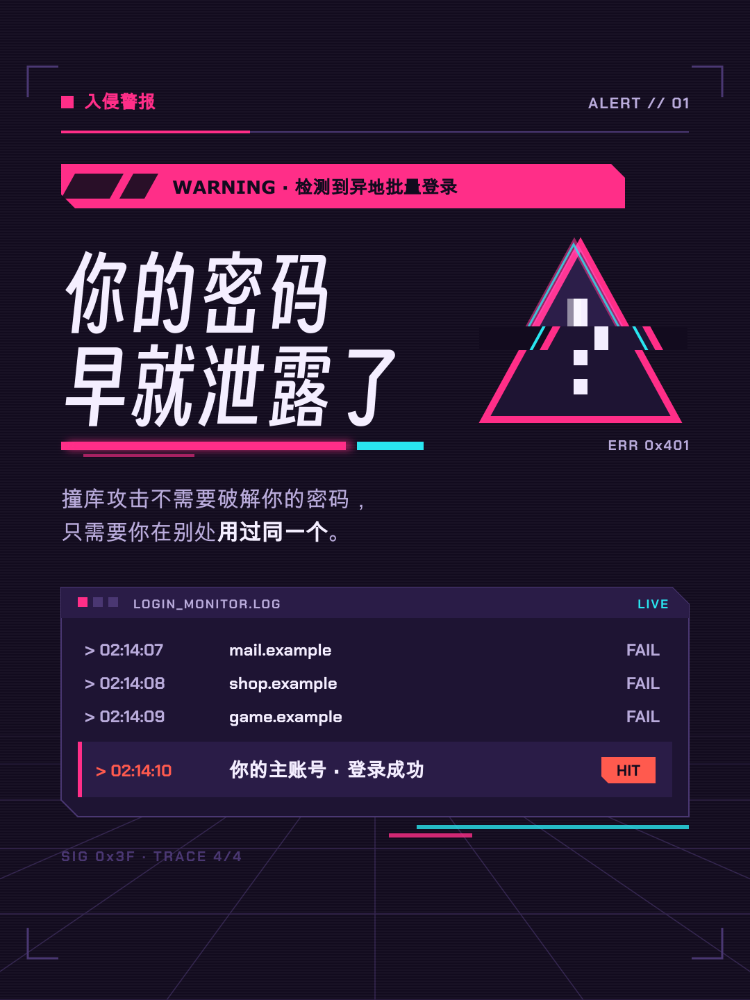
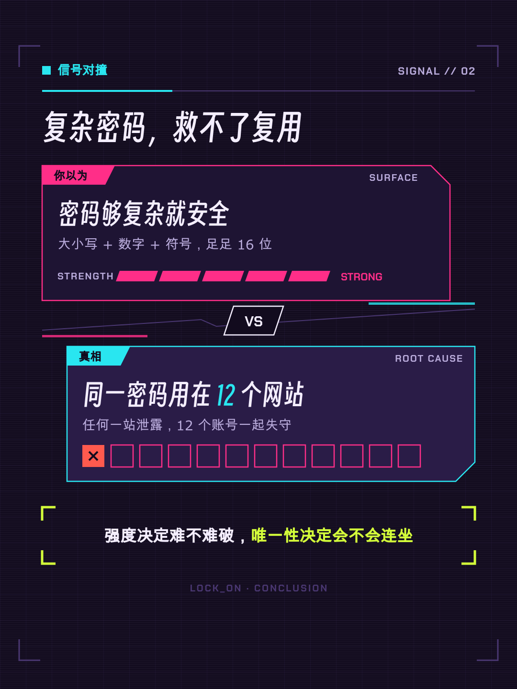
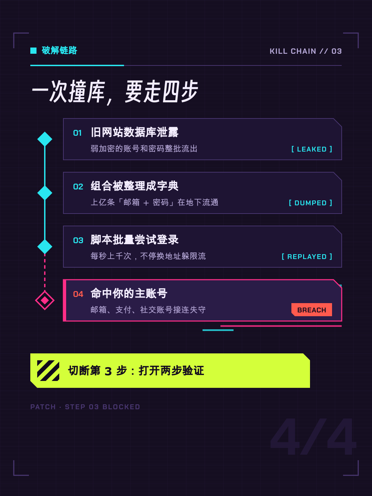
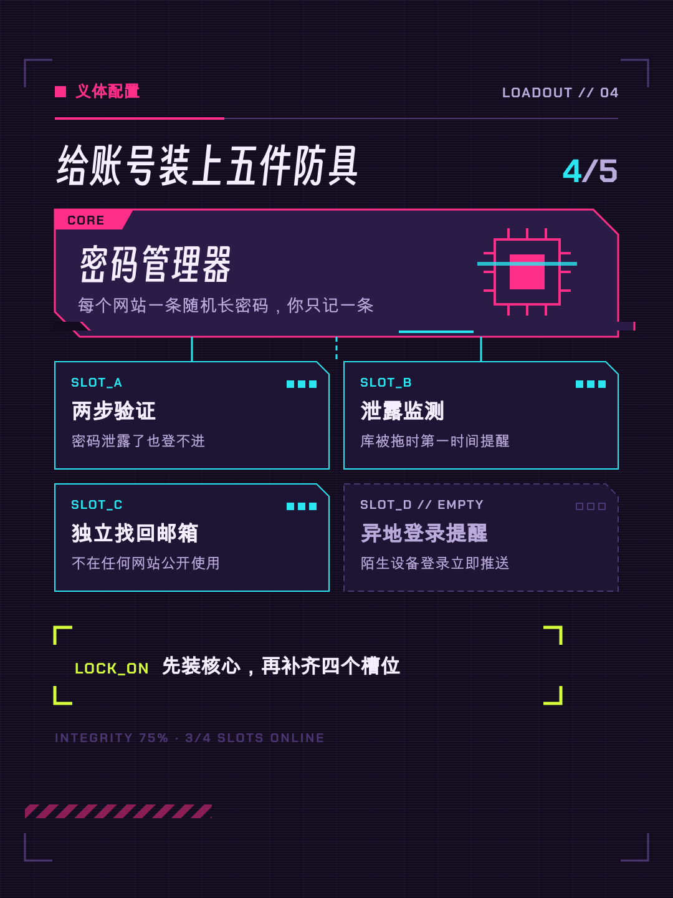
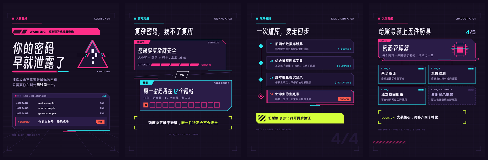

# “赛博故障”视频风格说明书

- 版本：1.0
- 适用：网络安全、攻防科普、黑客叙事、反常识观点、风险与故障复盘类竖屏解说
- 基准画幅：1080×1440，30fps

## 1. 风格定位

“赛博故障”把一段观点讲成一次入侵：信号被截获，画面短暂失真，随后被重新对齐成一条清晰结论。它借用赛博朋克的霓虹、终端和警示条，但核心任务仍然是**讲清楚**——故障只是节拍上的标点，读字的时间里画面必须干净、静止。

五个关键词：

- **锐利**：切角面板、硬切、斜向警示条，拒绝圆润。
- **紧张**：近黑紫底上只点亮少量霓虹，制造“有东西不对劲”的氛围。
- **反叛**：用对撞、破解、越权的隐喻讲反常识观点。
- **清醒**：每一次失真都会归位，结论总是稳定、对齐、可核对。
- **原创**：不借用任何商业游戏、电影或动漫的具体界面、Logo 和角色。

与相邻风格的区别：

- 与“科幻HUD”不同：那是冷静的青色仪表与瞄准框；这里是品红主导的入侵、警报和失真。
- 与“暗夜数据霓虹”不同：那是以图表为主角的数据叙事；这里以终端、链路和判断句为主角，数字只是证据。

## 2. 适用与不适用

适合：

- 网络安全、隐私、诈骗识别、系统漏洞和事故复盘。
- “你以为 A，其实是 B”式的反差观点与认知纠偏。
- 黑客文化、互联网史、技术圈故事。

不适合直接套用：

- 温情、童趣、养生、母婴等需要安全感的题材。
- 需要长时间阅读大段正文或密集表格的内容。
- 可能诱发光敏不适的受众场景（如必须更高频闪烁才能成立的创意）。

## 3. 品牌叙事原则

每个镜头先写一句体验描述，再写布局：

> 此刻被“截获”的是哪一条信号？它先以什么失真形态出现，又在哪一拍被对齐锁定？

优先使用以下叙事动作：

1. **截获**：警报、异常提示或问题以硬切进入。
2. **解密**：乱码逐字还原成真实文字（DECRYPT），还原在口播念到之前完成。
3. **突破**：链路节点被逐个点亮、越权、打通（BREACH）。
4. **对撞**：两条信号相遇，差异被放大。
5. **锁定**：结论被酸黄锁定框框住，画面回到完全静止（LOCK ON）。

## 4. 画布、安全区与网格

### 4.1 安全区

五层安全区的像素值以项目根目录 `frame.md` 的 `safe_area` 为准：

- `structural`：角标、坐标、警示斜条、扫描线等弱装饰。
- `main_content`：面板、终端窗、链路和图形。
- `critical_text`：标题、数字、结论、核心术语，主动避让右侧互动栏和底部 UI。
- `cover_title`：第 0 帧封面标题。
- `subtitles`：可选内嵌字幕。

非关键装饰可以越过关键文字区，但标题、数字、结论、Logo 和字幕不得进入平台 UI 避让区。

### 4.2 主内容轴与斜向节奏

- 左起 88px，标准宽度 904px。
- 标题、kicker、终端窗共用同一左轴；斜向元素（警示条、切片位移、切角）统一使用 45° 或 12° 两个角度，不临时发明其他倾角。
- 画面允许一条斜向“撕裂线”打破网格，但它只能是装饰层，不能切过关键文字。

## 5. 色彩系统

| Token | 色值 | 用途 |
|---|---|---|
| canvas | `#120B1E` | 近黑紫画布 |
| panel | `#1E1433` | 常规面板、终端窗 |
| panel_raised | `#2A1C47` | 抬升面板、选中项 |
| structure_line | `#4A3772` | 网格、分隔线、未激活描边 |
| ink | `#F4EEFF` | 主标题、正文 |
| muted_ink | `#B9ABDB` | 辅助说明、元数据 |
| hot_magenta | `#FF2E88` | 冲突、警报、入侵方、主强调 |
| signal_cyan | `#29E6F0` | 信号、数据、防守方、链路 |
| acid_yellow | `#D4FF3A` | 最终结论、锁定、通过 |
| alert_red | `#FF5A4E` | 真实风险、失败、错误 |
| ink_on_accent | `#120B1E` | 品红 / 青 / 酸黄填充上的文字 |

对比度（WCAG 2.x 相对亮度公式计算）：

| 组合 | 对比度 | 结论 |
|---|---:|---|
| ink / canvas | 16.9:1 | 任意字号 |
| muted_ink / canvas | 9.1:1 | 任意字号 |
| signal_cyan / canvas | 12.5:1 | 任意字号 |
| acid_yellow / canvas | 16.6:1 | 任意字号 |
| hot_magenta / canvas | 5.5:1 | 可作文字 |
| hot_magenta / panel | 5.0:1 | 可作文字 |
| hot_magenta / panel_raised | 4.4:1 | **不得作文字**，只作描边和色块 |
| alert_red / panel_raised | 5.0:1 | 可作文字 |
| ink_on_accent / hot_magenta | 5.5:1 | 品红填充上用深色字 |
| ink / hot_magenta | 3.1:1 | **禁止** |

规则：

- 品红与青是主对子，承担冲突与信号；酸黄只留给结论和锁定，整镜至多一处，不做装饰；除这三种与语义色 `alert_red` 外不引入其他霓虹色。
- 亮色填充（品红、青、酸黄）上的文字一律用 `ink_on_accent`，不用白字。
- 霓虹辉光只用于 ≥50px 的展示字和粗线条，模糊半径不超过 12px；正文不加辉光。
- 不使用与《赛博朋克 2077》界面相近的纯柠檬黄（如 `#FCEE0A`）加红色的组合；本风格的黄是偏绿的酸黄。

## 6. 字体与信息层级

### 6.1 字体角色

- **展示字**：`Smiley Sans`（得意黑，自带斜体，仅 400）。只用于封面、镜头标题、短口号，字号不小于 50px。
- **技术标签**：`Chakra Petch` 700。英文标签、编号、坐标、代码片段和数字。它不含中文，中文会回退到 `Noto Sans SC`。
- **正文**：`Noto Sans SC` 400 / 700。说明、结论正文、字幕一律显式指定它。
- 所有字体都必须以 `@font-face` 从项目 `assets/fonts/` 嵌入，不依赖任何本机字体。

### 6.2 字号

| 角色 | 字体 | 字号 | 字重 |
|---|---|---:|---:|
| 封面标题 | Smiley Sans | 84–124px | 400 |
| 镜头标题 | Smiley Sans | 50–72px | 400 |
| 正文 / 结论 | Noto Sans SC | 24–34px | 400–700 |
| 标签 / 元数据 | Chakra Petch | 18–24px | 700 |

中文正文不小于 24px。标题行距 1.00–1.12，正文行距约 1.40。技术标签可加 0.08em 字距，中文不加字距。

## 7. 空间与形状

### 7.1 留白节奏

- 同组元素：12–20px；堆叠面板：至少 18px；不同信息组：32–60px。
- 主面板内边距：28–40px；次级面板：22–28px。
- 标签、编号、状态、图标距面板边缘至少 22px；列表和进度条最后一行到底边至少 22px。

### 7.2 形状语言

- **切角面板**：矩形的一个或两个对角做 45° 切角，切角边长 16–32px。这是本风格的主识别形状。
- **圆角**：0 / 2 / 4 / 6px 四档，只用于细节柔化；999px 仅用于状态点和极少量胶囊。
- **警示条**：45° 斜纹条，品红或酸黄与画布色交替，只放在 `structural` 区或面板边缘。
- **扫描线**：2px 间距的横线，透明度不超过 8%，只在背景层。
- **锁定框**：四角 L 形括号，结论出现时收拢到位。

## 8. 组件语言

### 终端窗

`panel` 填充、`structure_line` 描边、顶部一条 36–44px 的标题栏（Chakra Petch 标签 + 三个方形状态块）。内容是伪代码或日志，行首用 `>` 或行号；不得出现可执行的真实攻击代码、真实 IP 或真实凭据。

### 警报条

品红底 + `ink_on_accent` 文字的横条，左侧带切角和警示斜纹。一个镜头最多一条。

### 链路节点

方形或菱形节点，未激活为 `structure_line` 描边，被突破后填充青色；连线用 2–3px 实线，待突破段用虚线。

### 义体槽位

切角面板组成的模块槽，已装配为青色描边 + 编号，核心模块用品红，最终方案用酸黄锁定框。

## 9. 四类镜头骨架

### 9.1 入侵警报（proposition）

用于封面、钩子、反常识判断和强结论。一句大判断 + 一条短解释 + 一个警报元素，最多两个焦点。



### 9.2 信号对撞（comparison）

用于表象与真相、旧认知与新认知、攻击方与防守方。上下两块面板以一条斜向撕裂线分开，一方品红、一方青；结论单独占一层，不塞进对比面板。



### 9.3 破解链路（process）

用于攻击链、排查步骤、因果链和状态逐级突破。纵向链路 + 节点 + 状态标签，被突破的节点逐个点亮，不做普通项目符号列表。



### 9.4 义体配置（capability_deck）

用于能力组合、工具清单、防护模块和最终方案。一个中心核心模块 + 周围若干槽位，最终方案用酸黄锁定框收束。



## 10. 动画语法

### 10.1 三阶段

- **Build 30%**：按信息优先级硬切或切片入场。
- **Breathe 45%**：信息完全静止可读，只保留一种环境动作（或没有）。
- **Resolve 25%**：锁定结论，或以一次短故障硬切退场。

### 10.2 品牌动作词

| 动作 | 含义 | 建议时长 |
|---|---|---|
| CUT IN | 无过渡硬切出现，可附 1–2 帧位移 | 0–2 帧 |
| SLICE | 元素被横切成 3–6 条，条带水平错位后归位 | 0.20–0.35s |
| SPLIT SETTLE | RGB 三通道错开 ≤8px 后合一 | 0.15–0.25s |
| DECRYPT | 乱码字符逐字还原为正文 | 0.30–0.50s |
| SCAN | 一条扫描线扫过面板，面板随之点亮 | 0.30–0.50s |
| BREACH | 链路节点被依次突破、填充 | 每节点 0.20–0.35s |
| LOCK ON | 四角括号收拢框住结论 | 0.20–0.30s |

入场 0.20–0.50s，ease-out 或 `steps()` 阶跃；退场 0.12–0.30s，ease-in 或硬切。第一动作延迟 0.10–0.30s。一个镜头中相同 ease 的独立 tween 不超过两个。

### 10.3 故障可读性边界

- 单次故障爆发不超过 0.25s；**必须在口播念到对应文字之前归位**。
- 文字归位后至少静止 18 帧，才允许下一次扰动。
- 每秒闪烁、反相或亮度跳变不超过 3 次（WCAG 2.3.1 三次闪烁阈值），不做全屏频闪、全屏反色、持续抖屏。
- 正文、字幕和数字结论不做 RGB 分离与切片；这些效果只作用于展示字、图形和面板。
- 故障的切片位置、偏移量、时刻来自固定种子的伪随机函数或手写关键帧表；任意帧 seek 结果必须一致。
- 稳定可读的静止保持完全合法，不需要为了“有动感”而持续扰动。

### 10.4 转场

- 同一冲突延续：扫描线推移或切片擦除。
- 新章节、新冲突：硬切，可附一次 ≤0.25s 的故障爆发。
- 重要信息进入后稳定 1.0–1.8s，再允许切镜头。

禁止弹跳、橡皮筋、持续漂浮、持续抖屏，以及所有元素同方向同速度入场。

## 11. 字幕、口播与声音

### 字幕

- 可选，最多两行；32–38px，最大宽度 812px，行距 1.30–1.40，每行建议不超过 16 个全角字符。
- `rgba(18,11,30,0.88)` 底、`#F4EEFF` 文字、14×22px 内边距、2px 圆角，字体 `Noto Sans SC`。
- 字幕不做任何故障效果，不遮挡链路节点、结论和锁定框。

### 口播

- 保持人声原速；信息密集段之间留真实停顿；句尾留画面展示时间，不拉伸人声。

### BGM 与 SFX

- 48kHz 双声道。BGM 可用暗色合成器低音、轻颗粒噪声；有人声时下压 6–10dB。
- 故障 SFX（短促数字噪声、电流咔哒）只标记钩子、切入、锁定和关键转场，同时最多两个，增益 -18 至 -12dB。
- 成片目标 -16 LUFS ±1，真峰值不高于 -1 dBTP，LRA 2–6 LU。
- 不使用任何商业游戏或电影的原声、音效片段。

## 12. 首帧封面

- 第 0 帧必须是完整、干净、无故障的完成态；标题不带 RGB 分离或切片。
- 默认两行，最多三行；单行不超过 9 个全角字符；字号 84–124px，最大宽度 812px。
- 文本与背景最低对比度 7:1。
- 30fps 下至少稳定 24 帧后才允许第一次故障扰动或转场。
- 不得以黑帧、噪点屏、解码乱码或半透明中间态开场。

## 13. 不可变项与可变项

### 不可变

- 画布、核心色、字体角色、安全区、空间比例、切角与圆角档位。
- 四类骨架的语义用途。
- 动作词、三阶段节奏、故障可读性边界、人声优先的声音目标。
- 字幕、封面、禁用项和验收门槛。

### 可变

- 镜头骨架选择和组合；图形隐喻、终端内容、节点数量、局部构图。
- 内容图片、产品截图、第三方 Logo（仅作内容素材）。
- 品红与青在对撞镜头中分给哪一方。

## 14. Do / Don’t

### Do

- 让故障服务于节拍：切入、转折、锁定。
- 读字时间里保持画面干净静止。
- 用切角、斜条、终端窗建立识别度，而不是堆特效。
- 酸黄只留给结论，让它成为全片最稀缺的颜色。

### Don’t

- 不复制《赛博朋克 2077》、《银翼杀手》、《攻壳机动队》等作品的 Logo、角色、界面和标志性配色；不用 Rajdhani 字体。
- 不做全屏频闪、反色、持续抖屏，不在正文上做 RGB 分离。
- 不用圆润网页卡片、渐变文字、弹跳动画。
- 不引入 token 以外的霓虹色，不把酸黄当装饰色。
- 不在终端里放真实可用的攻击代码、真实 IP 或凭据。
- 不给每个元素配故障音效，不让 BGM 盖住关键词。

## 15. 制作与验收清单

### 制作前

- [ ] 明确本镜头属于哪种骨架。
- [ ] 写出观众体验、图形隐喻和故障出现的节拍点。
- [ ] 标出主焦点的登场顺序（整镜最多两个）和三个景深层次。
- [ ] 核对关键文字安全区。

### 画面

- [ ] 色值全部来自 token；酸黄整镜至多一处且只用于结论。
- [ ] 字号、间距、切角、圆角符合范围；中文正文不小于 24px。
- [ ] `typography.font_files` 用到的每个字重都有 `@font-face`，`src` 指向镜头目录内真实存在的文件，且都是 `font-display: block`。渲染机不装系统字体，漏一条会静默回退成通用字体，本地看不出来。
- [ ] 标签和图标距边缘至少 22px；列表底部至少 22px。
- [ ] 无裁切、重叠和错误连接。

### 动画

- [ ] Build / Breathe / Resolve 完整。
- [ ] 每次故障在口播到达前归位，归位后静止至少 18 帧。
- [ ] 每秒闪烁不超过 3 次；无全屏频闪和持续抖屏。
- [ ] 每镜头最多一种环境动作。
- [ ] 故障由固定种子生成，任意帧可重建。

### 声音与交付

- [ ] 人声清晰且保持原速。
- [ ] BGM ducking 和淡入淡出正确；SFX 数量受控。
- [ ] 第 0 帧完成、干净并稳定至少 24 帧。
- [ ] 1080×1440、30fps、H.264/yuv420p/BT.709。

## 16. 可复制镜头提示词模板

```text
使用“赛博故障”风格制作本镜头。

品牌层必须读取并遵守项目根目录 frame.md：
- 不改核心色、字体角色、安全区、间距、切角、动作语法和声音目标。
- 根据当前文案从 proposition / comparison / process / capability_deck 中选择最合适的骨架。
- 镜头内部图形隐喻、终端内容、节点数量、局部构图和动画由你根据语义设计。
- 同一时刻只有一个主焦点；整镜最多两个焦点，按节拍依次登场；背景/中景/前景三个层次。
- 使用 CUT IN / SLICE / SPLIT SETTLE / DECRYPT / SCAN / BREACH / LOCK ON 等动作；故障由固定种子生成，在口播到达前归位，归位后静止至少 18 帧，每秒闪烁不超过 3 次。
- 展示字用 Smiley Sans，技术标签用 Chakra Petch，正文用 Noto Sans SC 且不小于 24px。
- 不复制任何商业游戏、电影的界面、Logo 和角色。
- 输出 1080×1440、30fps、静音、无音轨 MP4。

镜头文案：
{{SCENE_TEXT}}

镜头时长：
{{SCENE_DURATION_SECONDS}}
```

## 17. 通用验证资产

四类通用骨架联系表：



机器使用时，以根目录 [`frame.md`](../frame.md) 的 YAML frontmatter 为规范性来源。
