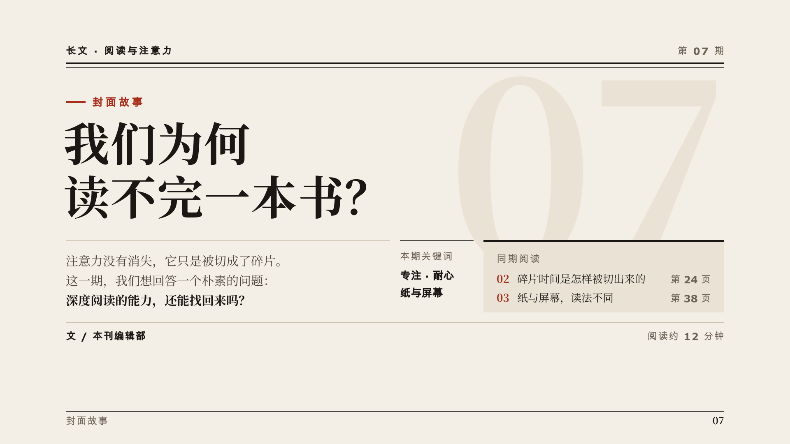
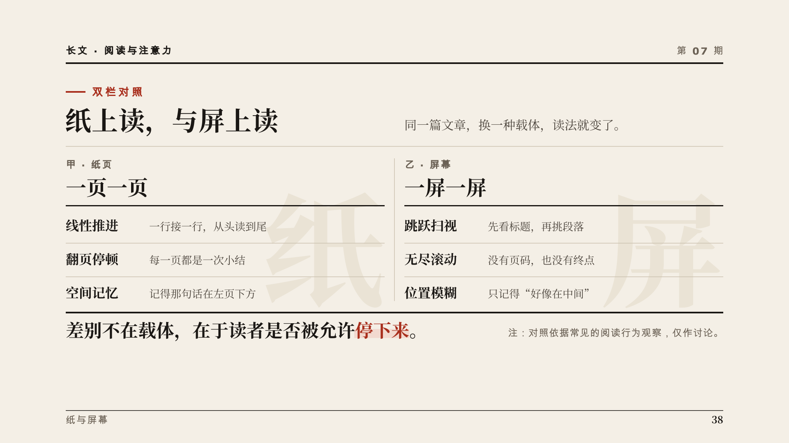
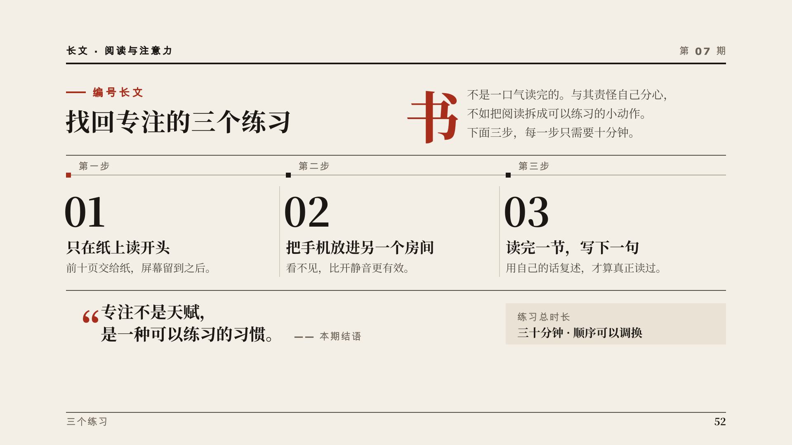
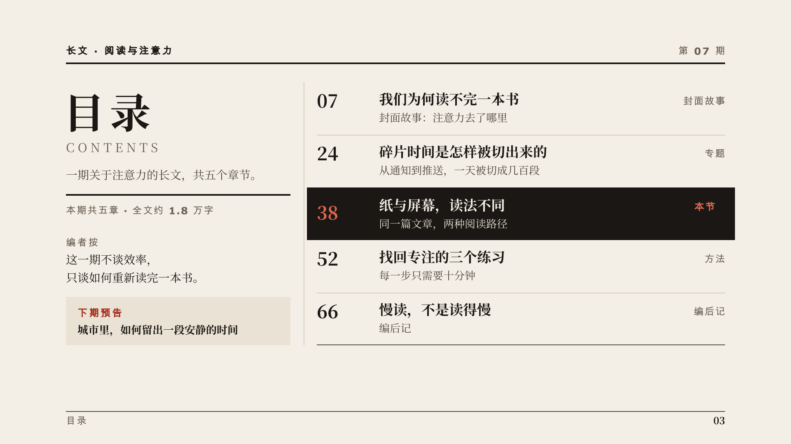
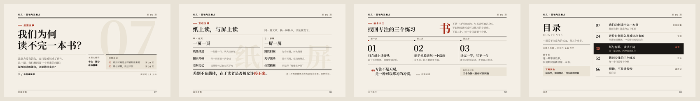

# “杂志编辑排版”视频风格说明书

- 版本：1.0
- 适用：观点评论、人文历史、商业分析、书评与长文导读类横屏解说
- 基准画幅：1920×1080，30fps

## 1. 风格定位

“杂志编辑排版”把一段口播当作一篇被精心排好的长文来呈现。画面不是信息图，而是一页页杂志内页：大号衬线标题定调，细线切分版面，导语把人引进来，引文把最锋利的一句话拎出来，编号把论证分成可回看的段落。

五个关键词：

- **沉静**：纸面、墨色、大量但有目的的留白。
- **有观点**：每一页只讲一个判断，标题就是论点。
- **讲究**：字号、行距、栏线、细线粗细都有规矩。
- **克制**：一个朱红强调色，一种环境动作，没有特效。
- **可信**：像编辑部出品，而不是模板生成。

## 2. 适用与不适用

适合：

- 观点输出、社会与文化评论、商业模式与公司分析。
- 历史、人物、书籍与思想的讲述。
- 需要“慢慢讲清一个判断”的中长篇口播。

不适合直接套用：

- 高能量娱乐、游戏、快节奏带货。
- 以复杂系统结构、数据仪表盘为主体的技术讲解（优先使用“清晰系统蓝图”）。

## 3. 编辑叙事原则

每个镜头先想清楚它在“这本杂志”里是哪一页：

> 这是封面、目录、正文某一节，还是一段对照？读者第一眼读到哪一行？读完之后，哪一句被留在版面上？

优先使用以下叙事动作：

1. **定题**：栏目眉题与大标题落定，给出本页判断。
2. **引入**：导语或首字下沉段落把论证展开。
3. **拆分**：细线与编号把论点切成节。
4. **拎出**：最关键的一句成为引文。
5. **收束**：朱红标记或署名行把本页合上。

## 4. 画布、安全区与网格

### 4.1 五层安全区

安全区的精确像素以根目录 `frame.md` 的 `safe_area` 为准：

- `structural`：版头粗线、页码、外侧页边的竖排栏目名。
- `main_content`：纸面色块、图片、细线的延伸端。
- `critical_text`：标题、导语、正文、引文、数字和结论。
- `cover_title`：第 0 帧封面标题。
- `subtitles`：可选内嵌字幕。

底部控制栏与进度条 的避让区里只能放非关键装饰，标题、数字、结论和字幕不得进入。

### 4.2 栏网格

| 项 | 值 |
|---|---:|
| 左轴 | 160px |
| 关键文字区宽 | 1600px |
| 栏数 | 竖屏 4 栏，横屏 8 栏 |
| 栏宽 | 约 180px（竖屏四栏、横屏八栏） |
| 栏距 | 24px |
| 栏线 | 从左轴起每隔「栏宽 + 栏距」一条，最右一栏的右缘即关键文字区右界 |
| 外侧页边 | 关键文字区右界到主内容区右缘 |

- 大标题跨满全部栏；导语通常少占一栏，留出一栏给边注或页码。
- 双栏对照各占两栏；正文段落至少跨两栏，避免过窄的中文行。
- 纵向节奏以正文行高（约 42–50px）为基线，标题、细线、引文落在基线上。
- 不追求居中对称；版面重心在左轴，用右下角的署名、页码或引文取得平衡。

### 4.3 下半部不得空置

杂志的留白是“有边界的留白”。横屏下半部必须有内容收住版面：导语段落、引文、署名行、页脚细线加页码、目录条目。整片空白的下半部会被读成“没排完”。

## 5. 色彩系统

| Token | 色值 | 用途 | 对纸面对比度 |
|---|---|---|---:|
| canvas | `#F4EFE6` | 暖白纸面 | — |
| paper_shade | `#EAE3D5` | 边栏、引文底、次级版块 | — |
| paper_light | `#FBF8F2` | 被拎出的卡片、封面标题底 | — |
| ink | `#1A1714` | 标题、正文、粗线、墨色底板 | 15.6:1 |
| body_ink | `#4A433B` | 次级正文、导语 | 8.5:1 |
| caption_gray | `#6B6155` | 图注、署名、页码 | 5.3:1 |
| vermilion | `#A82E1C` | 唯一强调色 | 6.0:1 |
| vermilion_tint | `#F2D9CF` | 关键词荧光底衬 | 墨字 13.3:1 |
| vermilion_on_ink | `#E0664F` | 墨色底板上的强调 | 对墨 5.3:1 |
| hairline | `#CBC1AF` | 细线、栏线 | 装饰 |
| hairline_strong | `#9C9080` | 外框、引号、弱装饰 | 装饰 |

规则：

- 朱红只用在编号、首字、引号、下划线和结论标记上。
- 墨色底板（`ink` 填充）是最高权重版块，只用于目录页的“本期主打”或全片最重要的一句结论。
- 不得新增任何强调色；否定用删除线与 `caption_gray`，肯定用朱红下划线。

## 6. 字体与信息层级

### 6.1 字体角色

- 标题、导语、正文、引文：`Noto Serif SC`，400 与 700 两个字重，随项目下发。
- 拉丁字母标题与数字可以使用 HyperFrames 自动内嵌的 `Playfair Display`；中文字符必须回落到 `Noto Serif SC`，所以字体栈写成 `"Playfair Display", "Noto Serif SC", serif`。
- 栏目眉题、图注、页码、署名、标签：`Noto Sans SC` 600/700，字距 2–4px，形成“衬线读、无衬线标”的对比。
- 不使用系统字体（宋体、苹方、冬青黑等），渲染机上不存在。

### 6.2 字号

| 角色 | 字号 | 字重 | 行距 |
|---|---:|---:|---:|
| 封面标题 | 84–120px | 700 | 1.10–1.20 |
| 页标题 | 50–68px | 700 | 1.10–1.20 |
| 引文 | 44–60px | 700 | 1.25 |
| 正文 / 导语 | 26–34px | 400 | 1.60 |
| 眉题 / 图注 / 页码 | 24–28px | 600–700 | 1.30 |
| 首字下沉 | 三行正文高 | 700 | — |

中文正文不得小于 24px。横屏阅读距离远，宁可删字也不缩字号。

### 6.3 排版细节

- 中文正文左对齐，不做两端对齐拉出的“河流”；行尾不留单字孤行。
- 引文使用朱红全角引号「」或弯引号，引号可以悬挂在左轴之外。
- 首字下沉：一个镜头最多一次，只用于第一段，朱红或墨色均可。
- 编号使用衬线数字 `01 02 03` 或中文“第一节”，不用圆点项目符号。

## 7. 空间与圆角

### 7.1 留白节奏

- 同组元素：14–24px。
- 堆叠版块：至少 24px。
- 不同信息组：40–72px。
- 主版块内边距：32–44px；次级版块：24–32px。
- 页码、眉题、边注距边缘：至少 22px。
- 目录与编号列表最后一行到底部细线：至少 22px。

### 7.2 圆角

杂志版面是方的。0px 用于绝大多数版块；2–6px 只用于字幕底和极小的标签。999px 胶囊只用于栏目标签，且每镜头至多一个。

## 8. 组件语言

### 版头

左上栏目眉题（无衬线、字距加宽）+ 右上期号或页码 + 一条 3–4px 墨色粗线。版头只画一次，不要每个版块都加。

### 细线

1.5px `hairline` 切分段落与栏；粗线只在版头与章节起点。细线从左轴画出，长度对齐栏线，不画到画面边缘。

### 首字下沉

三行高的衬线大字，后接正文。它是“开始读”的信号，不是装饰。

### 引文

两栏以上宽度，44–60px 衬线粗体，上方或左侧配朱红引号，下方一行无衬线署名。引文是全镜头最重的元素时，不再放大标题。

### 编号节

`01` 衬线大号编号 + 小标题 + 一两行正文，节与节之间用细线分开。编号是论证顺序，不是步骤流程图，不画箭头和节点。

### 目录条目

页码（朱红或墨色）+ 标题 + 一行摘要，条目间细线分隔；当前条目可用 `vermilion_tint` 底衬或墨色底板标出。

## 9. 四类镜头骨架

### 9.1 封面故事（proposition）

用于封面、钩子、章节开篇和一句定调的强观点。大标题占据上半版，导语与署名行收住下半版，朱红只点一处。



### 9.2 双栏对照（comparison）

用于两种观点、旧说与新说、表象与本质。两栏各占两栏宽，中间一条竖细线；结论单独成一行横跨全部栏，不塞进任一栏。



### 9.3 编号长文（process）

用于分节论证、时间线和因果链。大号编号 + 小标题 + 短正文，节间细线分隔，第一节可配首字下沉，末尾可接一句引文。



### 9.4 目录页（capability_deck）

用于全片导读、章节总览和结语回顾。页码列 + 标题列 + 摘要，当前章节被墨色底板或朱红底衬标出。



## 10. 动画语法

### 10.1 三阶段

- **Build 35%**：按阅读顺序入场——眉题、标题、细线、正文。
- **Breathe 45%**：版面稳定可读，最多一种环境动作（例如纸面极缓慢的 1–2% 推近），也可以完全静止。
- **Resolve 20%**：朱红标记落定，或整版 TURN PAGE 退场。

### 10.2 品牌动作词

- `SET_LINE`：每行文字从行框遮罩下方上移 30–60% 行高后露出，行与行错开 0.08–0.15s。
- `DRAW_RULE`：细线从左轴向右画出，时长 0.5–0.9s。
- `MASK_WIPE`：矩形遮罩自左向右擦出标题或图片。
- `DROP_CAP`：首字先落定，正文随后逐行排入。
- `PULL_QUOTE`：引号先出现，引文再逐行排入，署名最后淡入。
- `MARK`：朱红下划线或 `vermilion_tint` 底衬从左到右划过关键词。
- `TURN_PAGE`：整版水平平移换页，速度匹配下一版的入场。

入场 0.50–1.10s，使用 power2.out / power3.out / sine.inOut；退场 0.30–0.60s，使用 power2.in / sine.in。第一动作延迟 0.20–0.40s。动作数量由文案决定，不设配额；信息少时让版面安静停留。

### 10.3 转场

- 同一篇论证内：TURN_PAGE 或细线延伸成下一页的版头。
- 新章节：硬切到新版头，或 0.40–0.80s 的遮罩擦除。
- 重要引文落定后稳定 1.5–2.5s 再切。

禁止弹跳、回弹、发光、模糊闪现、逐字打字机正文，以及所有行同方向同速度入场。

## 11. 字幕、口播与声音

### 字幕

- 可选，最多两行，32–38px，最大宽度 1440px，行距 1.35–1.45。
- 每行建议不超过 16 个全角字符；专有名词、英文词组、数字与单位、引号内的引文不可拆开。
- 推荐 `rgba(26,23,20,0.86)` 墨色底、纸色文字、14×24px 内边距、2px 圆角。
- 字幕不得遮挡标题、引文、编号和结论标记。

### 口播

- 保持人声原速；段落之间留真实停顿，对应版面上的细线与分节。
- 句尾留画面展示时间，不用拉伸人声填时长。

### BGM 与 SFX

- 钢琴、弦乐或低饱和氛围音乐；避免强鼓点。
- 48kHz 双声道；人声 stem -18 至 -16 LUFS；BGM -30 至 -26 LUFS，有人声时下压 6–10dB。
- ducking attack 0.04–0.12s，release 0.25–0.60s；BGM 淡入淡出 0.80–1.50s。
- SFX 只用于翻页、章节起点和结论落定；单个 cue -18 至 -12dB，同时最多两个。
- 成片目标 -16 LUFS ±1，真峰值不高于 -1 dBTP，LRA 2–6 LU。

## 12. 首帧封面

- 第 0 帧必须是完整完成态：版头、标题、导语全部就位。
- 默认两行，最多三行；单行不超过 9 个全角字符。
- 标题最大宽度 1600px，字号 84–120px，行距 1.10–1.20。
- 文本与背景最低对比度 7:1（墨色对纸面约 15.6:1）。
- 30fps 下至少稳定 24 帧后才允许转场。
- 不得使用黑帧、空白、半透明中间态或必须等 MASK_WIPE 完成才看懂的封面。

## 13. 不可变项与可变项

### 不可变

- 纸面与墨色基调、朱红单一强调色、字体角色、安全区、栏网格、间距与圆角。
- 四类骨架的语义用途。
- 动作词、三阶段节奏、人声优先的声音目标。
- 字幕、封面、禁用项和验收门槛。

### 可变

- 栏目名、期号文字、引文内容、编号数量、局部版面切分。
- 被引用的图片、书影、人物照片（去饱和或单色处理，放在栏内）。
- 朱红出现的具体位置。

真实杂志、报纸的刊头、Logo、栏目标识和标志性版式不得复刻；它们只能作为被讨论的内容素材，以截图或引用形式出现。

## 14. Do / Don’t

### Do

- 让标题就是论点，一页一个判断。
- 用细线、编号和引文建立秩序。
- 按阅读顺序逐行排入，读完再切。
- 下半部用导语、引文、署名或页脚收住。
- 让朱红只出现在最值得看的一处。

### Don’t

- 不复刻真实刊物的刊头、Logo 与版式商标。
- 不做圆角卡片堆、投影卡片或网页式瀑布流。
- 不增加第二个强调色，不用渐变文字、发光和霓虹。
- 不使用弹跳、回弹和逐字打字机正文。
- 不让正文小于 24px，不让下半部整片空白。
- 不让 BGM 覆盖关键词、人名、数字和结论。

## 15. 制作与验收清单

### 制作前

- [ ] 明确本镜头属于哪种骨架，以及它在“这期杂志”里是哪一页。
- [ ] 写出标题（即论点）和要被拎出的那一句。
- [ ] 标出主焦点的登场顺序（整镜最多两个）和纸面 / 版式结构 / 正文三个层次。
- [ ] 核对关键文字安全区与栏网格。

### 画面

- [ ] 色值全部来自 token，只有朱红一个强调色。
- [ ] 字号、行距、间距、圆角符合范围，中文正文不小于 24px。
- [ ] `typography.font_files` 用到的每个字重都有 `@font-face`，`src` 指向镜头目录内真实存在的文件，且都是 `font-display: block`。渲染机不装系统字体，漏一条会静默回退成通用字体，本地看不出来。
- [ ] 标题、正文、细线贴齐栏线与左轴。
- [ ] 页码、眉题距边缘至少 22px；列表底部至少 22px。
- [ ] 下半部有内容收束；无裁切、重叠和孤字行。

### 动画

- [ ] Build / Breathe / Resolve 完整。
- [ ] 入场顺序符合阅读顺序。
- [ ] 每镜头最多一种环境动作。
- [ ] 动画确定性、可寻址、任意帧可重建；无弹跳、无发光。

### 声音与交付

- [ ] 人声清晰且保持原速。
- [ ] BGM ducking 和淡入淡出正确。
- [ ] SFX 只在翻页、章节起点和结论处出现。
- [ ] 第 0 帧完成并稳定至少 24 帧。
- [ ] 1920×1080、30fps、H.264/yuv420p/BT.709。

## 16. 可复制镜头提示词模板

```text
使用“杂志编辑排版”风格制作本镜头。

品牌层必须读取并遵守项目根目录 frame.md：
- 不改核心色、字体角色、安全区、栏网格、间距、圆角、动作语法和声音目标。
- 根据当前文案从 proposition / comparison / process / capability_deck 中选择最合适的骨架。
- 版面切分、引文取舍和动画由你根据语义设计。
- 同一时刻只有一个主焦点；整镜最多两个焦点，按节拍依次登场；纸面/版式结构/正文三个层次。
- 使用 SET_LINE / DRAW_RULE / MASK_WIPE / DROP_CAP / PULL_QUOTE / MARK / TURN_PAGE 等缓慢、克制的排版动作。
- 朱红是唯一强调色；不复刻任何真实杂志的刊头或 Logo。
- 下半部用导语、引文、署名或页脚收住，不留整片空白。
- 输出 1920×1080、30fps、静音、无音轨 MP4。

镜头文案：
{{SCENE_TEXT}}

镜头时长：
{{SCENE_DURATION_SECONDS}}
```

## 17. 通用验证资产

四类通用骨架联系表：



机器使用时，以根目录 [`frame.md`](../frame.md) 的 YAML frontmatter 为规范性来源。


## 横屏构图要点

本项目是 16:9 横屏（1920×1080），画面的主方向是左右而不是上下。风格说明书里按竖屏描述的版式骨架，落到横屏时按下面的原则改排：

- 左右分栏优先于上下堆叠：命题型用「左文右图」或「左大字、右主视觉」；对照型直接左右对开；流程型沿水平方向展开，最多 5 步，超过就分两行；系统总览用横向网格。
- 不要把竖屏版式原样居中：中间一条窄栏、两侧大面积空白，是横屏最常见的「没排完」。
- 一行文字不超过 22 个汉字：横屏宽度大，单行过长会让视线来回扫，宁可断行。
- 标题字号以画面高度 1080px 为基准，与竖屏的同级字号保持一致，不因为画面变宽而放大。
- 底部控制栏与进度条是关键避让区：标题、数字、结论和字幕都不得进入 critical_text 下沿以下的区域；字幕带贴在进度条上方。
