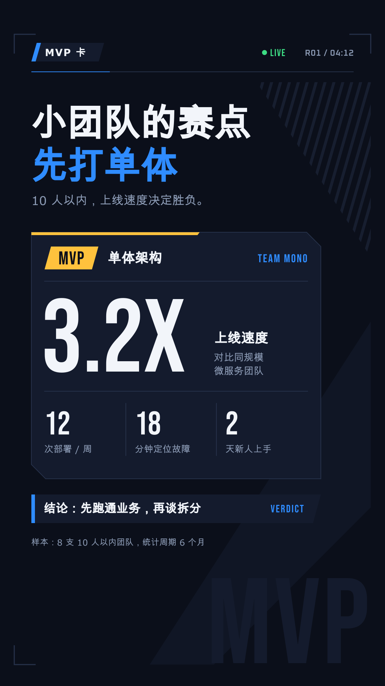
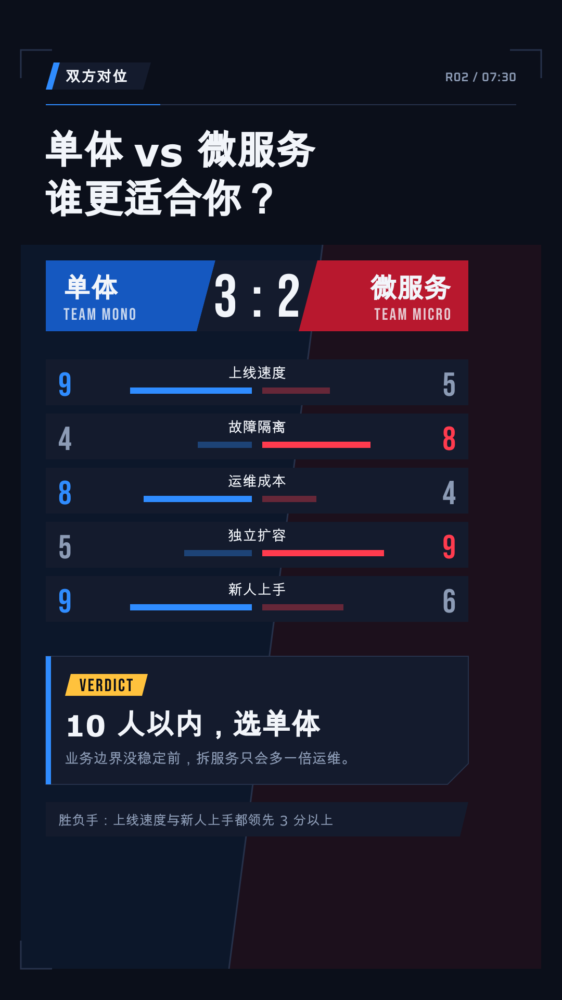
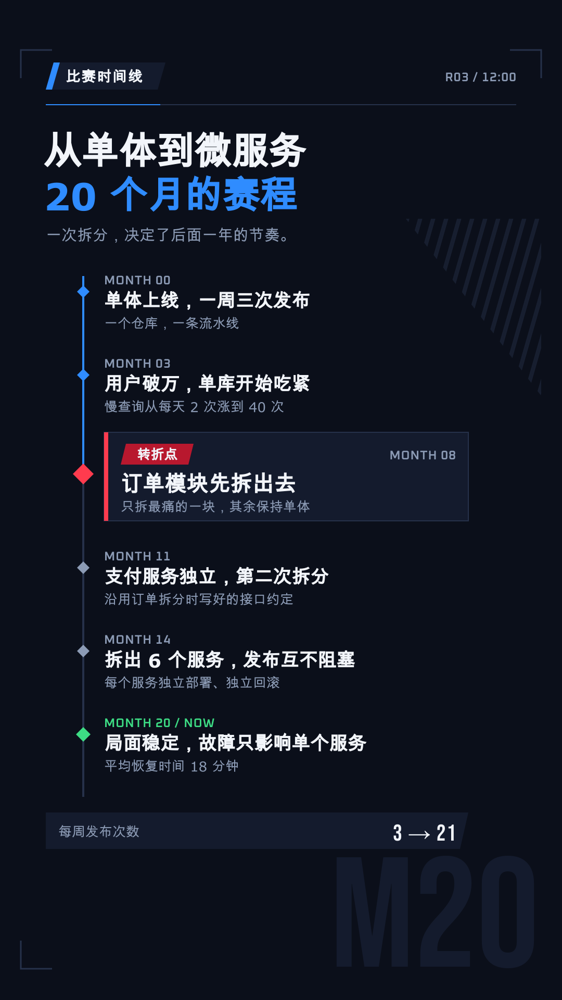
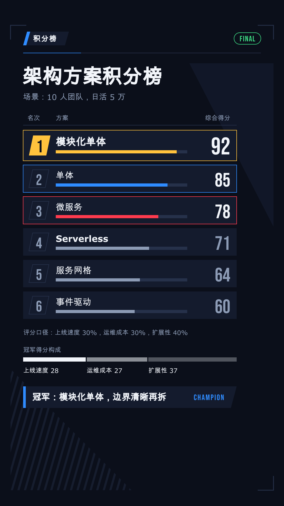
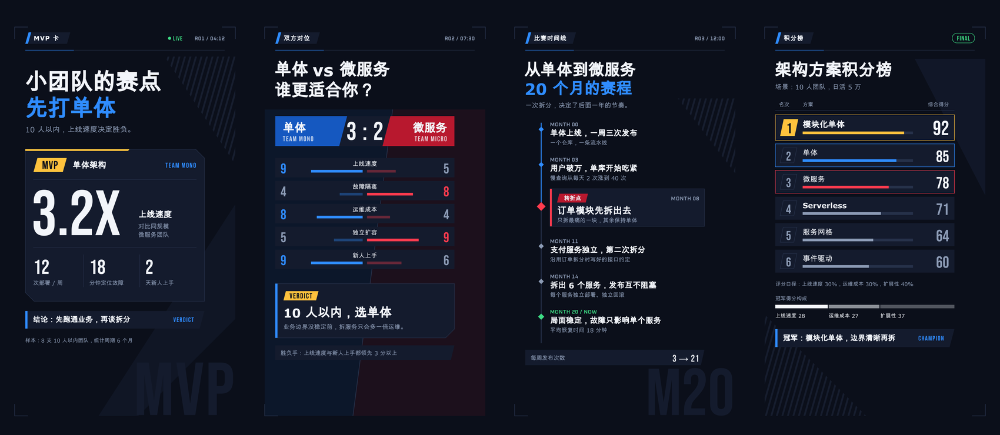

---
schema_version: 1
style_id: esports-broadcast-v1
style_name: 电竞赛事转播
scope:
  - head_to_head_comparison
  - product_and_tool_review
  - rankings_and_leaderboards
  - data_recap_and_scorecards
  - competitive_timeline_explainer
canvas:
  width_px: 1080
  height_px: 1920
  fps: 30
  orientation: vertical
safe_area:
  structural: {left_px: 40, right_px: 40, top_px: 96, bottom_px: 60}
  main_content: {left_px: 88, right_px: 88, top_px: 120, bottom_px: 100}
  critical_text: {left_px: 88, right_px: 180, top_px: 120, bottom_px: 260}
  cover_title: {left_px: 88, right_px: 180, top_px: 260, bottom_px: 940}
  subtitles: {left_px: 88, right_px: 180, top_px: 1470, bottom_px: 260}
colors:
  canvas: "#0B0F1A"
  panel: "#141B2D"
  ink: "#F2F5FA"
  support_gray: "#8C9BB5"
  structure_line: "#26314A"
  team_blue: "#2F8CFF"
  team_blue_fill: "#1558C0"
  team_red: "#FF3B4E"
  team_red_fill: "#B8182E"
  highlight_gold: "#FFC23D"
  live_green: "#3DDC84"
typography:
  primary_stack: '"Noto Sans SC", sans-serif'
  mono_stack: '"Oxanium", "Noto Sans SC", monospace'
  display_stack: '"Bebas Neue", "Noto Sans SC", sans-serif'
  font_files:
    - {family: "Noto Sans SC", weight: 400, file: "assets/fonts/noto-sans-sc-400.woff2"}
    - {family: "Noto Sans SC", weight: 600, file: "assets/fonts/noto-sans-sc-600.woff2"}
    - {family: "Noto Sans SC", weight: 700, file: "assets/fonts/noto-sans-sc-700.woff2"}
    - {family: "Noto Sans SC", weight: 900, file: "assets/fonts/noto-sans-sc-900.woff2"}
    - {family: "Bebas Neue", weight: 400, file: "assets/fonts/bebas-neue-400.woff2"}
    - {family: "Oxanium", weight: 600, file: "assets/fonts/oxanium-600.woff2"}
  sizes_px:
    cover_min: 80
    cover_max: 112
    title_min: 46
    title_max: 64
    numeral_min: 96
    numeral_max: 220
    body_min: 24
    body_max: 34
    label_min: 20
    label_max: 26
  weights:
    display: 900
    heading: 700
    body: 400
    body_emphasis: 600
    metadata: 600
    numeral: 400
  line_heights:
    display_min: 1.00
    display_max: 1.08
    numeral: 0.90
    body: 1.36
    metadata: 1.2
spacing:
  content_left_px: 88
  content_width_px: 904
  group_min_px: 12
  group_max_px: 20
  card_stack_min_px: 12
  card_main_padding_min_px: 28
  card_main_padding_max_px: 36
  card_secondary_padding_min_px: 20
  card_secondary_padding_max_px: 26
  section_min_px: 32
  section_max_px: 56
  element_edge_min_px: 22
  skeleton_bottom_min_px: 22
radius:
  sm_px: 2
  md_px: 4
  lg_px: 6
  xl_px: 8
  pill_px: 999
scene_archetypes:
  - id: proposition
    name: MVP 卡
    use_for: 封面、钩子、章节开场、单点强结论与关键数字
    example_png: assets/style-guide/examples/proposition.png
  - id: comparison
    name: 双方对位
    use_for: 两种方案、两个产品、旧做法与新做法的逐项对位
    example_png: assets/style-guide/examples/comparison.png
  - id: process
    name: 比赛时间线
    use_for: 步骤、阶段、时间节点、局势转折
    example_png: assets/style-guide/examples/process.png
  - id: capability_deck
    name: 积分榜
    use_for: 排行、多项打分、多方案横评、最终战报
    example_png: assets/style-guide/examples/capability_deck.png
motion:
  phases: {build: 0.25, breathe: 0.50, resolve: 0.25}
  entrance_seconds: {min: 0.24, max: 0.50}
  exit_seconds: {min: 0.16, max: 0.36}
  transition_seconds: {min: 0.18, max: 0.36}
  first_action_delay_seconds: {min: 0.10, max: 0.24}
  entrance_ease: [power4.out, expo.out, power3.out]
  exit_ease: [power4.in, expo.in]
  verbs: [WIPE, SLAM, SPLIT, TICK, STACK, FLAG, CROWN]
  ambient_per_scene_max: 1
  max_same_ease_tweens: 2
audio:
  sample_rate_hz: 48000
  channels: 2
  voice_integrated_lufs: {min: -18, max: -16}
  bgm_integrated_lufs: {min: -30, max: -26}
  bgm_ducking_db: {min: 6, max: 10}
  ducking_attack_seconds: {min: 0.04, max: 0.12}
  ducking_release_seconds: {min: 0.25, max: 0.60}
  bgm_fade_seconds: {min: 0.80, max: 1.50}
  sfx_gain_db: {min: -18, max: -12}
  sfx_max_simultaneous: 2
  final_integrated_lufs: -16
  final_lufs_tolerance: 1
  true_peak_max_dbtp: -1
  lra_lu: {min: 2, max: 6}
subtitles:
  required: false
  font_size_px: {min: 32, max: 38}
  max_width_px: 812
  max_lines: 2
  max_fullwidth_chars_per_line: 16
  line_height: {min: 1.30, max: 1.40}
  background: "rgba(11, 15, 26, 0.88)"
  text_color: "#F2F5FA"
  padding_px: {vertical: 14, horizontal: 22}
  radius_px: 4
  break_rules:
    - keep_proper_nouns_intact
    - keep_english_phrases_intact
    - keep_numbers_and_units_intact
    - preserve_real_speech_gaps
cover:
  frame_zero_complete: true
  default_lines: 2
  max_lines: 3
  max_fullwidth_chars_per_line: 10
  font_size_px: {min: 80, max: 112}
  line_height: {min: 1.00, max: 1.08}
  max_width_px: 812
  contrast_ratio_min: 7.0
  stable_frames: 18
forbidden:
  - black_or_blank_frame_zero
  - cover_fade_in_intermediate_state
  - real_league_team_game_or_sponsor_marks
  - copied_broadcast_package_layouts
  - fake_betting_odds_or_gambling_ui
  - arbitrary_new_team_colors
  - more_than_two_team_colors_per_scene
  - gradient_text
  - neon_purple_blue_gradient
  - motion_blur_or_smear_frames
  - excessive_glitch_or_rgb_split
  - camera_shake_on_text
  - elastic_or_bouncy_motion
  - text_moving_during_hold
  - continuous_ticker_crawl_behind_body
  - all_elements_same_direction_same_speed
  - labels_or_icons_touching_edges
  - skeleton_or_list_without_bottom_padding
  - sfx_on_every_element
  - crowd_roar_or_airhorn_over_voice
  - music_masking_voice
---# “电竞赛事转播”视频风格说明书

- 版本：1.0
- 适用：对比评测、排行榜、多方案横评、数据战报、阶段复盘类竖屏解说
- 基准画幅：1080×1920，30fps

## 1. 风格定位

“电竞赛事转播”借用赛事直播包装的视觉语法，讲任何题材里的「较量」。两种方案可以是蓝方与红方，五款工具可以排成一张积分榜，一个项目的演进可以画成一条比赛时间线，最终结论可以是一张 MVP 卡。

五个关键词：

- **对抗**：信息以「双方」或「名次」组织，胜负关系一眼可见。
- **数据**：大号窄体数字是主角，结论必须能落到一个比分、分数或名次上。
- **利落**：斜切几何、硬边面板、快进快停的动作。
- **可读**：动作再快，文字到位后必须静止；深底白字，对比度充足。
- **克制的兴奋**：金色只给胜者，节奏快但不吵。

## 2. 适用与不适用

适合：

- 「A 还是 B」的方案对比、产品评测、路线之争。
- 排行榜、横评、多维打分和年度盘点。
- 有明确阶段与转折的复盘：谁在哪一步领先、哪一步翻盘。

不适合直接套用：

- 需要安静、温和或严肃语气的题材（医疗、灾难、悼念、心理支持）。
- 没有比较对象、也没有数字结论的纯叙事内容。
- 涉及真实赛事、真实战队或博彩的内容——本风格不承担真实转播包装，也不做赔率界面。

## 3. 品牌叙事原则

每个镜头先写一句体验描述，再写布局：

> 观众此刻在看哪一场「对局」？谁和谁？比分在哪一刻揭晓？最后谁被加冕？

优先使用以下叙事动作：

1. **登场**：双方或参赛项以信息条滑入，亮出名字和阵营色。
2. **对位**：同一指标左右并列，差值被标出。
3. **转折**：时间线上的关键节点被旗标标记。
4. **揭晓**：数字从 0 滚到终值，一次到位后静止。
5. **加冕**：胜者获得金色描边或金色名次块，结论锁定。

## 4. 画布、安全区与网格

### 4.1 五层安全区

具体像素以根目录 `frame.md` 的 `safe_area` 为准，各层职责如下：

| 区域 | 用途 |
|---|---|
| `structural` | 斜切角标、背景斜纹、LIVE 标记等弱装饰 |
| `main_content` | 面板、信息条、积分榜主体 |
| `critical_text` | 标题、比分、数字、结论 |
| `cover_title` | 第 0 帧封面标题 |
| `subtitles` | 可选内嵌字幕 |

右侧与底部的平台 UI 区是关键避让区。斜切装饰可以伸进去，但比分、名次、结论、队名和字幕不得进入。

### 4.2 主内容轴

- 左起 88px，标准宽度 904px。
- 标题左对齐；信息条的斜切端朝向画面中心或朝向对手一侧。
- 双方对位时以画面中线为对抗轴，VS 或比分贴中线放置。

## 5. 色彩系统

| Token | 色值 | 用途 | 对比度（对 canvas） |
|---|---|---|---:|
| canvas | `#0B0F1A` | 深藏青黑画布 | — |
| panel | `#141B2D` | 信息条、面板、表格行底 | — |
| ink | `#F2F5FA` | 标题、正文、比分 | 17.5:1 |
| support_gray | `#8C9BB5` | 辅助说明、次要数据 | 6.8:1 |
| structure_line | `#26314A` | 分隔线、表格线、外框 | 装饰 |
| team_blue | `#2F8CFF` | 蓝方文字、描边、指示条 | 5.8:1 |
| team_blue_fill | `#1558C0` | 蓝方填色块（白字 6.0:1） | — |
| team_red | `#FF3B4E` | 红方文字、描边、指示条 | 5.5:1 |
| team_red_fill | `#B8182E` | 红方填色块（白字 6.0:1） | — |
| highlight_gold | `#FFC23D` | 胜者、MVP、第一名、最终结论 | 11.9:1 |
| live_green | `#3DDC84` | 进行中、通过、已达成 | 10.7:1 |

在 `panel` 上各文字色对比度依次约为 15.7、6.1、5.2、4.9、10.7:1，均高于 4.5:1。金色块上放字时用 `canvas` 色字（11.9:1），不放白字。

用色规则：

- 阵营色只标识归属。一镜最多两种阵营色；积分榜的多方条目用灰阶面板区分，只给第一名金色、给被讨论的一两项阵营色。
- 金色每镜至多一处，是「谁赢了」的唯一答案。
- 不引入第三种阵营色、紫色霓虹或渐变文字。大面积背景永远是 `canvas`。

## 6. 字体与信息层级

### 6.1 字体角色

- 中文标题、正文、结论：`Noto Sans SC`，封面与大标题 900，镜头标题 700，正文 400–600。
- 拉丁大数字、比分、队名缩写、英文标签：`display_stack`，即 `Bebas Neue` 400。它只有大写拉丁字形，没有中文。
- 计时器、局数、版本号等元数据：`mono_stack`，即 `Oxanium` 600。
- 所有字体必须用 `@font-face` 从镜头目录内嵌，不依赖系统字体。

### 6.2 字号

| 角色 | 字号 | 字重 |
|---|---:|---:|
| 大数字 / 比分 | 96–220px | 400（Bebas Neue） |
| 封面标题 | 80–112px | 900 |
| 镜头标题 | 46–64px | 700 |
| 正文 / 结论 | 24–34px | 400–600 |
| 标签 / 元数据 | 20–26px | 600 |

中文任何时候不小于 24px。大数字行距 0.90，标题行距 1.00–1.08，正文约 1.36。

## 7. 空间与形状

### 7.1 留白节奏

- 同组元素：12–20px；堆叠信息条至少 12px。
- 不同信息组：32–56px。
- 主面板内边距：28–36px；次级信息条：20–26px。
- 标签、编号、状态、图标距边缘：至少 22px。
- 积分榜、列表最后一行到底边：至少 22px。

### 7.2 斜切与圆角

- 信息条和面板用平行四边形或单侧斜切，角度 12–18°，全片统一一个角度。
- 圆角只取 2 / 4 / 6 / 8px；胶囊 999px 只用于 LIVE、FINAL 等状态标签。
- 队标用自绘几何徽记（盾形、菱形、字母组合），不得借用任何真实战队或联赛标识。

## 8. 组件语言

### 记分牌（scorebug）

顶部或中轴的紧凑横条：左蓝右红两个队名块，中间是比分与局数。是每镜最稳定的锚点，不随镜头乱跳。

### 下三分之一条（lower third）

斜切面板 + 一条阵营色竖条 + 中文主行 + 拉丁副行。用于给出一句判断或来源。

### VS 分屏

画面按中线斜切成两半，蓝方与红方各占一侧，VS 放在切线中点。切线是运动的主轴。

### MVP 卡

一张高卡：金色描边或金色名次块、Bebas Neue 大数字、一句中文结论、两到三行数据。

### 积分榜

多行表格：名次、名称、指标条、分数。第一名金色名次块，其余灰阶；被讨论的一行可以用阵营色描边。

## 9. 四类镜头骨架

### 9.1 MVP 卡

用于封面、钩子、章节开场和单点强结论。一张卡、一个大数字、一句判断，最多两个焦点。



### 9.2 双方对位

用于两种方案、两个产品、新旧做法的逐项对比。左蓝右红，中轴是比分；最终结论单独占一层，不塞进任一方的面板。



### 9.3 比赛时间线

用于步骤、阶段、时间节点和局势转折。横向或纵向轨道，节点带计时读数，关键转折点用旗标。



### 9.4 积分榜

用于排行、多维打分、多方案横评和最终战报。第一名是唯一金色锚点，其余行保持安静。



## 10. 动画语法

### 10.1 三阶段

- **Build 25%**：信息条按优先级快速擦入，比分揭晓。
- **Breathe 50%**：全部文字静止可读，只保留一种环境动作。
- **Resolve 25%**：加冕胜者或硬切退场。

### 10.2 品牌动作词

- `WIPE`：面板沿斜切方向擦入，遮罩边缘与斜切角一致。
- `SLAM`：大数字或 VS 从略大尺寸（不超过 1.08 倍）硬落到位，无回弹。
- `SPLIT`：画面沿中线斜切分开，双方各自就位。
- `TICK`：数字从起点滚到终值，揭晓时一次完成。
- `STACK`：积分榜行自上而下依次落位，间隔 0.04–0.08s。
- `FLAG`：时间线节点被旗标标记。
- `CROWN`：胜者获得金色描边或名次块。

入场 0.24–0.50s，使用 `power4.out`、`expo.out` 或 `power3.out`；退场 0.16–0.36s，使用 `power4.in` 或 `expo.in`。第一动作延迟 0.10–0.24s，避免第 0 帧跳变。一个镜头中相同 ease 的独立 tween 不超过两个。

### 10.3 静止原则

速度感来自入场，不来自持续运动。文字到位后不抖、不漂、不闪；不叠加镜头晃动、RGB 分离或运动模糊。允许的环境动作只有一种，例如背景斜纹极慢平移或 LIVE 圆点慢闪。

### 10.4 转场

- 同一对局内：信息条直接替换，保持记分牌不动。
- 新章节：0.18–0.36s 的斜切色块 stinger，完全遮挡的帧不超过 3 帧。
- 重要信息落位后稳定 1.0–1.8s，再允许切镜头。

禁止弹跳、橡皮筋、持续滚动字条、过度 glitch，以及所有元素同方向同速度入场。

## 11. 字幕、口播与声音

### 字幕

- 可选，最多两行。
- 32–38px，最大宽度 812px，行距 1.30–1.40，每行建议不超过 16 个全角字符。
- 专有名词、英文词组、数字与单位不可拆开。
- 推荐 `rgba(11,15,26,0.88)` 底、`#F2F5FA` 文字、14×22px 内边距、4px 圆角。
- 字幕不得遮挡比分、MVP 卡数字和积分榜第一名。

### 口播

- 保持人声原速；揭晓数字前留一个真实停顿，让画面先亮比分。
- 句尾留画面展示时间，不用拉伸人声填时长。

### BGM 与 SFX

- BGM 可以是有推进感的电子节拍，但有人声时下压 6–10dB，不得盖过关键词和数字。
- SFX 只给揭晓（短促击打）、对位（一次 whoosh）、加冕（一次明亮点缀），同时最多两个。
- 不使用人群欢呼、气笛喇叭、解说员或游戏音效采样。
- 响度、ducking、淡入淡出与真峰值目标见 frontmatter `audio`。

## 12. 首帧封面

- 第 0 帧必须是完整完成态：MVP 卡或比分已经在位，数字是终值。
- 默认两行，最多三行；单行不超过 10 个全角字符；标题最大宽度 812px，字号 80–112px。
- 文本与背景最低对比度 7:1。
- 30fps 下至少稳定 18 帧后才允许转场。
- 不得使用黑帧、空白、半截擦除或必须等数字滚完才看懂的封面。

## 13. 不可变项与可变项

### 不可变

- 画布、核心色、阵营色语义、字体角色、安全区、空间比例、斜切角度与圆角。
- 四类骨架的语义用途。
- 动作词、三阶段节奏、静止原则、人声优先的声音目标。
- 字幕、封面、禁用项和验收门槛。

### 可变

- 双方身份、比分口径、条目数量、局部构图。
- 自绘几何队标的形状。
- 内容图片、产品截图与第三方产品 Logo（仅作内容素材）。

## 14. Do / Don’t

### Do

- 把结论落到一个比分、名次或分数上。
- 让胜方一侧略重，金色只出现一次。
- 动作快进快停，落位后让文字完全静止。
- 斜切角度全片统一，标签不贴边。
- 中文一律 `Noto Sans SC`，数字交给 `Bebas Neue`。

### Don’t

- 不使用任何真实联赛、战队、游戏或赞助商标识，不复刻某家转播包装的具体版式。
- 不做赔率、下注、抽奖界面。
- 不引入第三种阵营色、紫蓝霓虹或渐变文字。
- 不加运动模糊、镜头抖动、RGB 分离和持续滚动字条。
- 不让 BGM、音效覆盖关键词、数字和结论。

## 15. 制作与验收清单

### 制作前

- [ ] 明确本镜头属于哪种骨架，谁是蓝方、谁是红方、谁获胜。
- [ ] 写出观众体验：同一时刻只有一个主焦点；整镜最多两个焦点，按节拍依次登场。
- [ ] 规划背景、中景、前景三个层次。
- [ ] 核对关键文字安全区。

### 画面

- [ ] 色值全部来自 token；阵营色每镜不超过两种，金色至多一处。
- [ ] 字号、间距、斜切、圆角符合范围；中文不小于 24px。
- [ ] `typography.font_files` 用到的每个字重都有 `@font-face`，`src` 指向镜头目录内真实存在的文件，且都是 `font-display: block`。渲染机不装系统字体，漏一条会静默回退成通用字体，本地看不出来。
- [ ] `Bebas Neue` / `Oxanium` 没有被用来排中文。
- [ ] 标签和图标距边缘至少 22px；积分榜底部至少 22px。
- [ ] 无裁切、重叠、真实商标。

### 动画

- [ ] Build / Breathe / Resolve 完整。
- [ ] 入场顺序符合信息优先级；数字只滚动一次。
- [ ] 文字落位后静止；每镜头最多一种环境动作。
- [ ] 动画确定性、可寻址、任意帧可重建。

### 声音与交付

- [ ] 人声清晰且保持原速。
- [ ] BGM ducking 和淡入淡出正确。
- [ ] SFX 数量受控且不覆盖关键词。
- [ ] 第 0 帧完成并稳定至少 18 帧。
- [ ] 1080×1920、30fps、H.264/yuv420p/BT.709。

## 16. 可复制镜头提示词模板

```text
使用“电竞赛事转播”风格制作本镜头。

品牌层必须读取并遵守项目根目录 frame.md：
- 不改核心色、字体角色、安全区、间距、斜切与圆角、动作语法和声音目标。
- 根据当前文案从 proposition / comparison / process / capability_deck 中选择最合适的骨架。
- 镜头内部图形隐喻、条目数量、局部构图和动画由你根据语义设计。
- 同一时刻只有一个主焦点；整镜最多两个焦点，按节拍依次登场；背景/中景/前景三个层次。
- 使用 WIPE / SLAM / SPLIT / TICK / STACK / FLAG / CROWN 等硬减速动作，落位后文字静止。
- 不出现任何真实联赛、战队、游戏或赞助商标识。
- 输出 1080×1920、30fps、静音、无音轨 MP4。

镜头文案：
{{SCENE_TEXT}}

镜头时长：
{{SCENE_DURATION_SECONDS}}
```

## 17. 通用验证资产

四类通用骨架联系表：



机器使用时，以根目录 [`frame.md`](../frame.md) 的 YAML frontmatter 为规范性来源。
