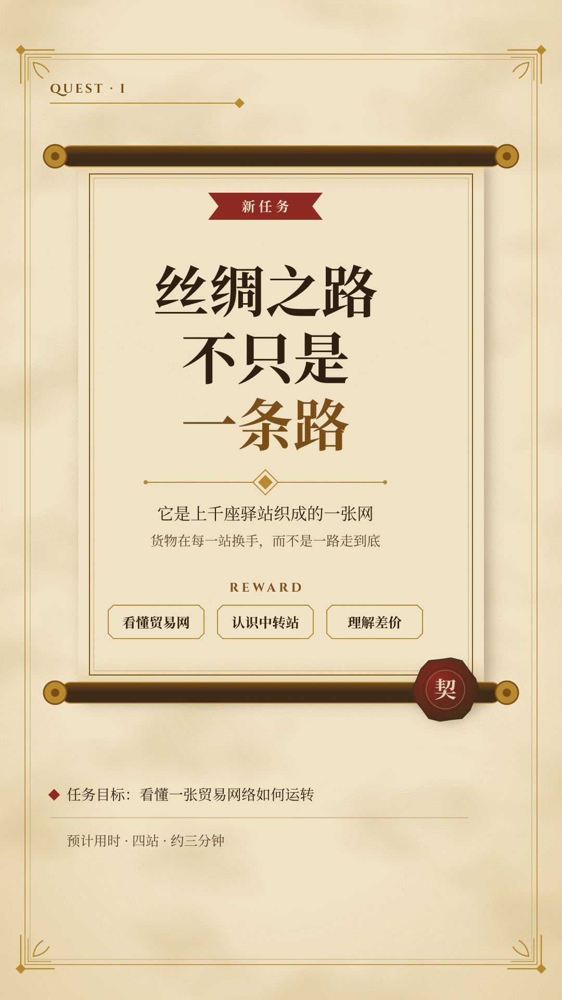
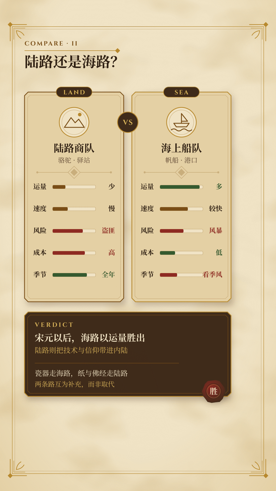
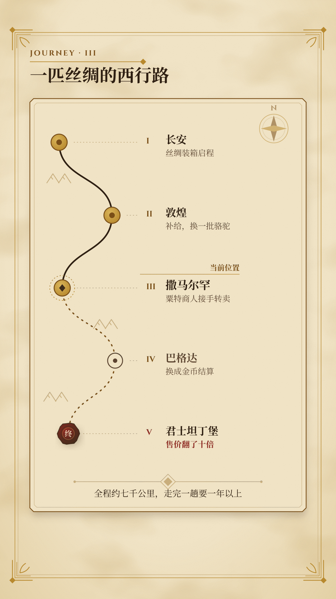
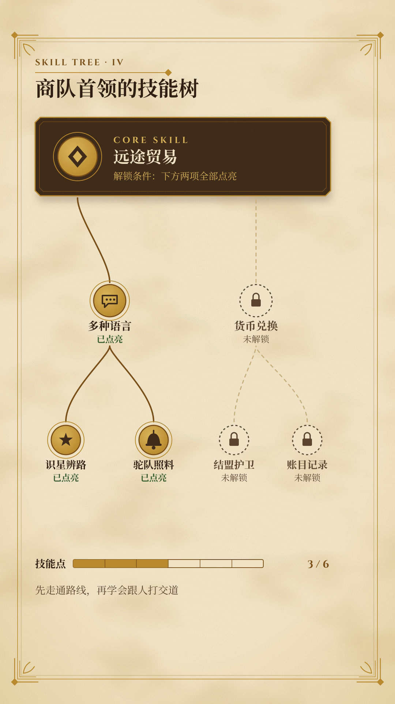
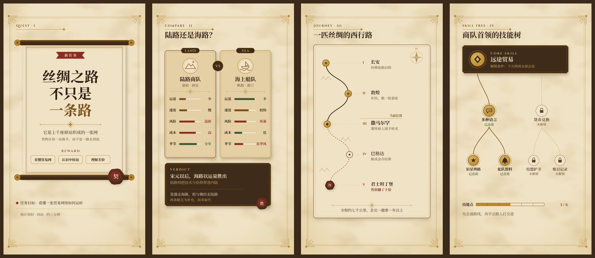

# “奇幻羊皮卷”视频风格说明书

- 版本：1.0
- 适用：历史、故事、学习路线、成长路径、世界观与人文知识类竖屏解说
- 基准画幅：1080×1920，30fps

## 1. 风格定位

“奇幻羊皮卷”把讲解包装成一卷冒险手札：命题是一张任务卷轴，对比是两张装备卡，步骤是一张旅程地图，能力体系是一棵技能树。观众熟悉 RPG 的语汇，因此“接任务—选装备—走路线—点技能”这条隐喻能让抽象结构立刻变得可读。

五个关键词：

- **沉静**：动作像纸张展开、墨迹洇开，平缓而确定。
- **古典**：衬线字体、羊皮纸、金铜边框、火漆与符文。
- **叙事**：每个镜头都是旅程中的一站，有起点、路径和落点。
- **克制**：金色只做边框与点缀，华丽装饰只包一个主容器。
- **可信**：信息层级清晰，纸面装饰永远让位给文字。

## 2. 适用与不适用

适合：

- 历史事件、人物传记、文明与地理故事。
- 学习路线、技能成长、职业进阶和知识体系梳理。
- 小说、神话、游戏文化等世界观解读。
- 需要“把一段路讲清楚”的方法论视频。

不适合直接套用：

- 实时数据、金融行情、严肃医疗或安全告警等需要现代冷静界面的题材。
- 快节奏娱乐、搞笑梗和强消费冲动内容。

这些题材若必须使用本风格，应把奇幻语汇降到边框与分隔线，只保留羊皮纸画布与衬线层级。

## 3. 品牌叙事原则

每个镜头先写一句体验描述，再写布局：

> 观众此刻站在旅程的哪一站？先展开什么，后描出什么？最后哪一枚火漆落下？

优先使用以下叙事动作：

1. **接取**：卷轴展开，任务名与目标出现。
2. **比较**：两张装备卡翻开，属性逐行对照。
3. **启程**：地图上的墨线沿路径描出，站点依次点亮。
4. **解锁**：技能节点从灰到金，依赖连线被点亮。
5. **封存**：结论落在深色皮革面板或火漆印上，成为稳定锚点。

## 4. 画布、安全区与网格

### 4.1 五层安全区

具体像素值以本画幅 `frame.md` 的 `safe_area` 为准，下表说明用途：

| 区域 | 用途 |
|---|---|
| structural | 外框、角花、地图边饰、弱装饰 |
| main_content | 卷轴、卡牌、地图主体 |
| critical_text | 标题、数字、结论、核心术语 |
| cover_title | 第 0 帧封面标题 |
| subtitles | 可选内嵌字幕 |

右侧互动栏和底部 UI 是关键避让区。角花、地图海岸线等非关键装饰可以进入，但标题、数字、结论、火漆文字和字幕不得进入。

### 4.2 主内容轴

- 左起 96px，标准宽度 888px。
- 卷轴与卡牌可以居中放置，但标题、章节铭文与正文共用同一左轴或同一中轴，一个镜头只选一种。
- 地图与技能树允许斜向视线，但起点与终点都要落在关键文字区内。

## 5. 色彩系统

| Token | 色值 | 用途 | 对比度（对 canvas） |
|---|---|---|---:|
| canvas | `#F1E4C6` | 羊皮纸画布 | — |
| parchment_deep | `#E4D0A4` | 卡面、卷轴内衬、纸纹暗部 | — |
| ink | `#2E1F12` | 主标题、正文 | 12.6:1 |
| ink_soft | `#5C4330` | 辅助说明、未解锁文字 | 7.2:1 |
| bronze | `#7A4E17` | 强调字、编号、青铜边框 | 5.7:1 |
| gold | `#B8892E` | 边框、角花、符文线、图标描边 | 2.5:1（禁止做正文） |
| gold_light | `#D9B45A` | 皮革面板上的强调字与已解锁节点 | 6.8:1（对 leather） |
| leather | `#3F2B1A` | 结论与能力核心的深色面板 | — |
| rule_line | `#C9AE7C` | 细分隔线、卡片内线、虚线路径 | — |
| wax_red | `#8E2A22` | 火漆、否定、风险、终点标记 | 6.7:1 |
| quest_green | `#355A2F` | 完成、已达成、推荐选项 | 6.3:1 |

- 所有正文配色在 canvas 与 parchment_deep 上均 ≥ 4.5:1；`gold` 在羊皮纸上只达 2.5:1，只能用于装饰或 62px 以上的标题描边。
- 火漆红与任务绿是语义色，不作装饰轮换。
- 皮革面板上的正文使用 canvas 色（10.6:1），强调使用 gold_light。

## 6. 字体与信息层级

### 6.1 字体角色

- 中文标题与正文：`Noto Serif SC`（400 / 700）。
- 拉丁铭文、罗马数字、章节编号与英文小标题：`Cinzel` 700，全大写，字距 0.08–0.16em。
- 不使用哥特黑体字（blackletter）、手写花体或任何系统字体；所有字体都要以 `@font-face` 从项目 `assets/fonts/` 嵌入。

### 6.2 字号

| 角色 | 字号 | 字重 |
|---|---:|---:|
| 封面标题 | 78–108px | 700 |
| 镜头标题 | 46–62px | 700 |
| 正文 / 结论 | 26–34px | 400–700 |
| 铭文 / 标签 | 22–26px | 700 |

衬线中文比黑体更“松”，标题行距取 1.08–1.18，正文约 1.45。不要使用渐变文字或金属质感文字。

## 7. 空间与圆角

### 7.1 留白节奏

- 同组元素：14–22px。
- 堆叠卡片：至少 18px。
- 不同信息组：36–60px。
- 主卡内边距：32–40px；次级卡：24–30px。
- 标签、火漆、图标距容器边缘：至少 24px。
- 列表、路径和进度条最后一项到底边：至少 24px。

### 7.2 圆角与切角

- 4px：小标签、属性条。
- 8px：字幕底、属性行、次级面板。
- 12px：装备卡、常规卡片。
- 16px：主卷轴内框、皮革面板。
- 999px：宝石徽章、章节 chip。
- 50%：技能节点、火漆、地图站点。

奇幻语汇更常用切角（45° 小切口）而不是大圆角。切角尺寸固定为 12px，不要在同一镜头混用多种切角。

## 8. 组件语言

### 任务卷轴

上下两根卷轴杆（皮革色圆柱 + 金色端帽），中间是羊皮纸面。卷轴内只放一个大命题和一条短解释。封面第 0 帧必须已完全展开。

### 装备卡

卡面 parchment_deep，外框 bronze 或 gold 双线，顶部一枚宝石徽章标注“品级”或类别。属性用短横条表达相对强弱，数值写在条尾。两张卡只比较同一组属性。

### 地图与路径

路径用 rule_line 或 bronze 虚线，已走过的段落变为实线墨迹。站点是圆形印记，终点用火漆红。地形（海岸、山脊）只作 structural 层的淡墨线，不画具象插画。

### 技能树

节点为圆形徽记，未解锁为 ink_soft 描边空心，已解锁为 gold_light 填充 + bronze 描边。连线表示前置依赖，自下而上或自上而下生长，方向全片一致。

### 火漆与符文分隔线

火漆是 wax_red 不规则圆 + 内圈压印，只出现在结论处，每镜最多一枚。符文分隔线是中心菱形 + 两侧细线，只用几何符号，不写可读的伪文字。

### 皮革面板

`#3F2B1A` 是最高权重组件，只承载结论、能力核心或最终奖励。常规说明不要放进皮革面板。

## 9. 四类镜头骨架

### 9.1 任务卷轴（proposition）

用于封面、钩子、章节开场和最终结论。一张展开的卷轴，一个大判断加一条短解释，火漆落在结论处。



### 9.2 装备对比卡（comparison）

用于两种方案、两个时代、两条路线的取舍。左右两张卡片对照同一组属性，结论单独落在下方皮革面板，不塞进卡片。



### 9.3 旅程地图（process）

用于步骤、学习路线、历史进程和因果链。一条蜿蜒墨线串起站点，每站一个短标签，终点用火漆红标记。



### 9.4 技能树（capability_deck）

用于能力体系、知识结构和前置依赖。核心节点在皮革面板上，分支节点按依赖逐层点亮。



## 10. 动画语法

### 10.1 三阶段

- **Build 30%**：按信息优先级展开。
- **Breathe 45%**：让信息稳定可读；允许完全静止，最多保留一种环境动作。
- **Resolve 25%**：盖章封存结论或平缓退场。

### 10.2 品牌动作词

| 动作 | 做法 |
|---|---|
| UNROLL | 卷轴杆沿纵轴移动，纸面用 `clip-path` 同步揭开 |
| UNFOLD | 卡片从 `scaleY` 0.96 与透明度展开，不翻转 180° |
| INK_DRAW | SVG 路径 `stroke-dashoffset` 描出，线端圆头 |
| TRACE_PATH | 地图墨线沿路径推进，站点在墨线到达时点亮 |
| ILLUMINATE | 技能节点由 ink_soft 描边过渡到 gold_light 填充 |
| STAMP_SEAL | 火漆从 1.08 缩至 1.00，透明度同步到 1，无回弹 |
| FADE_IN | 正文与说明平缓淡入，可叠加 12–20px 位移 |

入场 0.45–0.90s，使用 ease-out；退场 0.25–0.50s，使用 ease-in。第一动作延迟 0.10–0.30s，避免第 0 帧跳变。一个镜头中相同 ease 的独立 tween 不超过两个。

### 10.3 环境动作

每镜头最多一种：烛光暖色叠层的缓慢明暗呼吸、地图罗盘指针的极小摆动，或纸面光斑的缓慢平移。纸纹 `feTurbulence` 本身不得动画化——改变 seed 或 baseFrequency 会让画面逐帧闪烁。

### 10.4 转场

- 同一旅程的连续站点：墨线延伸到下一镜、横向推移地图。
- 新章节：卷轴收起后展开新卷轴，或 0.30–0.60s 的纸面淡化。
- 重要信息进入后稳定 1.2–2.0s，再允许切镜头。

禁止弹跳、橡皮筋、震屏、燃烧或撕纸转场、持续漂浮的魔法粒子，以及所有元素同方向同速度入场。

## 11. 字幕、口播与声音

### 字幕

- 可选，最多两行。
- 32–38px，最大宽度 812px，行距 1.35–1.45。
- 每行建议不超过 16 个全角字符。
- 专有名词、英文词组、数字与单位不可拆开。
- 推荐 `rgba(46,31,18,0.86)` 墨褐底、羊皮纸色文字、14×24px 内边距、8px 圆角。
- 字幕不得遮挡地图站点、技能节点、火漆和结论面板。

### 口播

- 保持人声原速，语气像讲故事而不是念清单。
- 章节之间留真实停顿，让卷轴展开的动作完整呈现。

### BGM 与 SFX

- BGM 以古典弦乐、竖琴、鲁特琴或民谣为宜，避免史诗大鼓长时间铺底。
- 48kHz 双声道；人声 stem -18 至 -16 LUFS；BGM -30 至 -26 LUFS，有人声时下压 6–10dB。
- ducking attack 0.04–0.12s，release 0.25–0.60s；BGM 淡入淡出 0.80–1.50s。
- SFX 只用于卷轴展开（纸张摩擦）、盖章（闷响）、技能解锁（轻铃）和章节转场；单 cue -18 至 -12dB，同时最多两个。
- 成片目标 -16 LUFS ±1，真峰值不高于 -1 dBTP，LRA 2–6 LU。

## 12. 首帧封面

- 第 0 帧必须是完整完成态：卷轴已展开、标题已写完、火漆已落定。
- 默认两行，最多三行；单行不超过 9 个全角字符。
- 标题最大宽度 812px，字号 78–108px，使用 ink 色。
- 文本与背景最低对比度 7:1。
- 30fps 下至少稳定 18 帧后才允许转场。
- 不得使用黑帧、空白、卷起状态、半透明中间态或必须等动画完成才看懂的封面。

## 13. 不可变项与可变项

### 不可变

- 画布、核心色、字体角色、安全区、空间比例和圆角。
- 四类骨架的语义用途。
- 动作词、三阶段节奏、人声优先的声音目标。
- 纸纹的固定 seed 与静态性。
- 字幕、封面、禁用项和验收门槛。

### 可变

- 镜头骨架选择和组合。
- 图形隐喻、图标、地图地形、节点数量、局部构图。
- 内容图片、人物、历史文物照片和第三方 Logo（作为内容素材）。
- 火漆与任务绿的具体出现位置。

本风格借用的是通用奇幻语汇，不是任何具体游戏。不得复刻商业游戏的 Logo、角色、界面框体、专有图标或字体。

## 14. Do / Don’t

### Do

- 用卷轴、卡片、路径和技能节点表达真实关系。
- 让最重要的信息先展开，结论最后封存。
- 华丽边框只包一个主容器，其余用细线和留白组织。
- 纸纹始终是背景层，文字区局部可以更平整。
- 让皮革面板成为少量、高价值的视觉锚点。

### Don’t

- 不用位图纸纹、图库卷轴或 AI 生成的奇幻插画当底。
- 不用金色写正文，不做渐变或金属质感文字。
- 不给每个元素都套花边框，不堆满角花与宝石。
- 不使用弹跳、震屏、燃烧撕纸、闪烁魔法粒子。
- 不让 BGM 覆盖人名、地名、年代和结论。

## 15. 制作与验收清单

### 制作前

- [ ] 明确本镜头属于哪种骨架。
- [ ] 写出观众体验：旅程中的哪一站、什么被展开、什么被封存。
- [ ] 标出主焦点的登场顺序（整镜最多两个）和三个景深层次。
- [ ] 核对关键文字安全区。

### 画面

- [ ] 色值全部来自 token，正文无金色小字。
- [ ] 字号、间距、圆角与切角符合范围，中文正文不小于 24px。
- [ ] `typography.font_files` 用到的每个字重都有 `@font-face`，`src` 指向镜头目录内真实存在的文件，且都是 `font-display: block`。渲染机不装系统字体，漏一条会静默回退成通用字体，本地看不出来。
- [ ] 纸纹 `feTurbulence` 固定 seed、不随时间变化。
- [ ] 标签、火漆和图标距边缘至少 24px。
- [ ] 列表、路径底部至少 24px。
- [ ] 无裁切、重叠、错误连线和光学偏移。

### 动画

- [ ] Build / Breathe / Resolve 完整。
- [ ] 入场顺序符合信息优先级，无弹跳与回弹。
- [ ] 每镜头最多一种环境动作。
- [ ] 动画确定性、可寻址、任意帧可重建。

### 声音与交付

- [ ] 人声清晰且保持原速。
- [ ] BGM ducking 和淡入淡出正确。
- [ ] SFX 数量受控且不覆盖关键词。
- [ ] 第 0 帧完成并稳定至少 18 帧。
- [ ] 1080×1920、30fps、H.264/yuv420p/BT.709。

## 16. 可复制镜头提示词模板

```text
使用“奇幻羊皮卷”风格制作本镜头。

品牌层必须读取并遵守项目根目录 frame.md：
- 不改核心色、字体角色、安全区、间距、圆角、动作语法和声音目标。
- 根据当前文案从 proposition（任务卷轴）/ comparison（装备对比卡）/ process（旅程地图）/ capability_deck（技能树）中选择最合适的骨架。
- 镜头内部图形隐喻、节点数量、局部构图和动画由你根据语义设计。
- 同一时刻只有一个主焦点；整镜最多两个焦点，按节拍依次登场；背景/中景/前景三个层次。
- 使用 UNROLL / INK_DRAW / TRACE_PATH / ILLUMINATE / STAMP_SEAL 等平缓、确定的动作，不弹跳。
- 羊皮纸只用矢量渐变与固定 seed 的 feTurbulence，不用位图纹理。
- 保持标签、火漆、图标和列表底部留白，不得贴边。
- 输出 1080×1920、30fps、静音、无音轨 MP4。

镜头文案：
{{SCENE_TEXT}}

镜头时长：
{{SCENE_DURATION_SECONDS}}
```

## 17. 通用验证资产

四类通用骨架联系表：



机器使用时，以根目录 [`frame.md`](../frame.md) 的 YAML frontmatter 为规范性来源。
