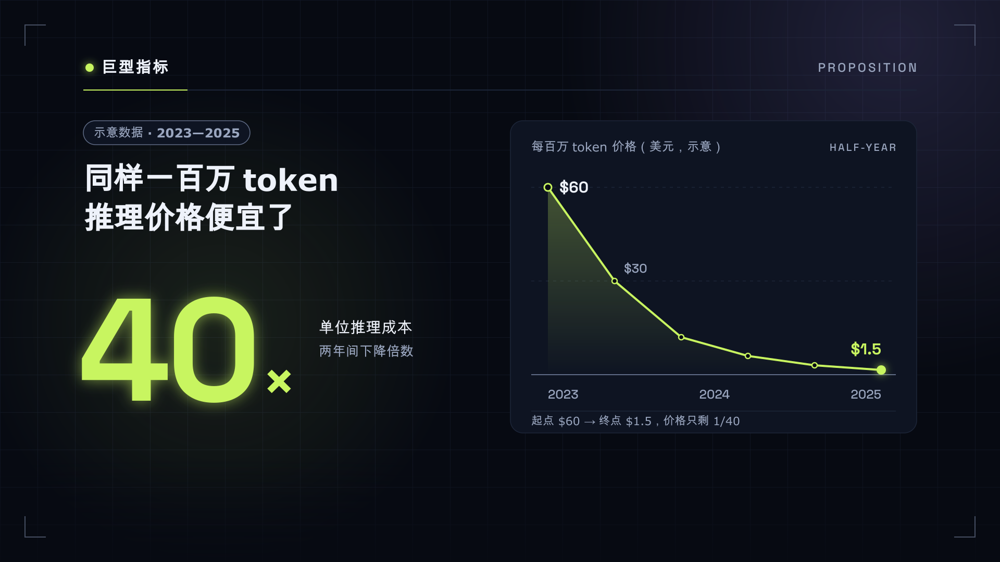
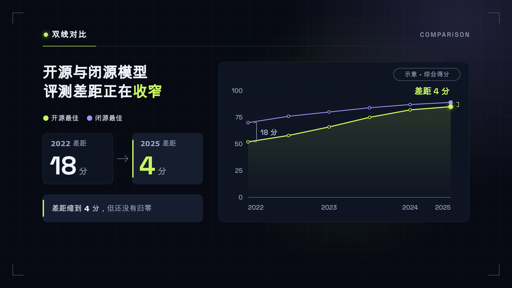
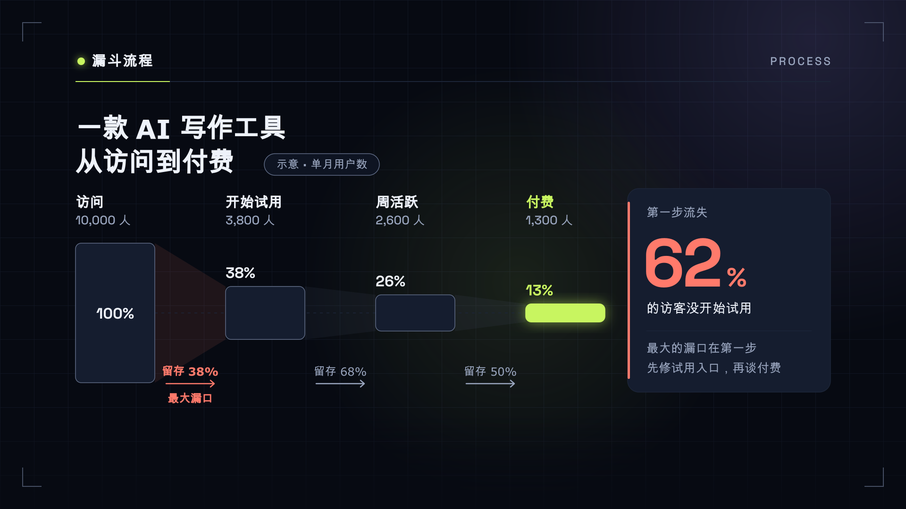
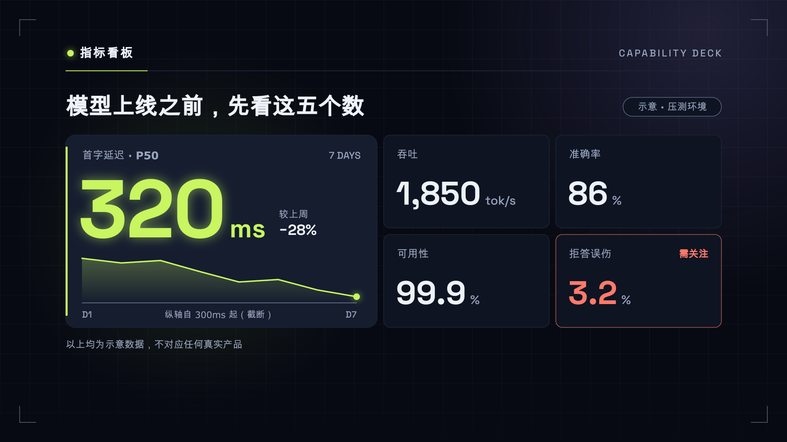
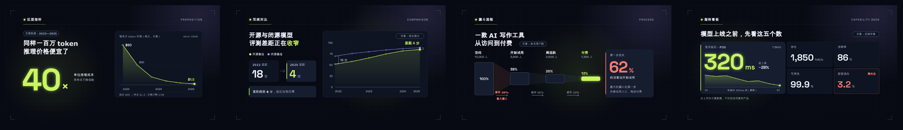

# “暗夜数据霓虹”视频风格说明书

- 版本：1.0
- 适用：AI、前沿技术、数据解读、指标与评测、行业趋势类横屏解说
- 基准画幅：1920×1080，30fps

## 1. 风格定位

“暗夜数据霓虹”把一篇文章里最关键的几个数字，放到一块深夜仍在运行的数据大屏上。底色安静，网格几乎看不见，只有真正重要的数字、曲线和柱子亮起。观众的眼睛不需要找重点——亮的就是重点。

五个关键词：

- **精确**：数字有单位、有来源、有合理精度。
- **聚焦**：一次只亮一处，第二处按节拍再亮。
- **冷静**：暗底与克制的辉光，不做夜店式霓虹。
- **洞察**：每张图只回答一个问题。
- **前沿**：几何无衬线数字、细线网格、平滑的指数缓动。

它是数据讲解风格，不是游戏界面，也不是赛博朋克：没有扫描线、故障、HUD 瞄准框和角色属性条。

## 2. 适用与不适用

适合：

- AI 模型、算力、成本、参数规模等指标解读。
- 行业报告、增长趋势、转化漏斗、评测成绩。
- 以「一个数字」为钩子的科普与观点视频。

不适合直接套用：

- 故事叙述、情感与人物为主的内容。
- 没有任何数据或量化关系的纯观点内容——那会让大屏空转。
- 童趣、生活方式与温暖治愈类题材。

## 3. 叙事原则

每个镜头先写一句体验描述，再写布局：

> 观众此刻应该记住哪一个数字？它和什么比较？比较完之后得出什么判断？

优先使用以下叙事动作：

1. **亮出**：一个数字或一条曲线从暗底中出现。
2. **比较**：出现基线、对照组或上一阶段。
3. **收窄**：漏斗逐级收窄，损耗被标红。
4. **定格**：数字停在最终值，结论出现。

## 4. 画布、安全区与网格

### 4.1 安全区

安全区像素值以 `frame.md` frontmatter 的 `safe_area` 为准，本节只说明用途：

| 区域 | 用途 |
|---|---|
| `structural` | 背景网格、角标、坐标刻度等弱装饰 |
| `main_content` | 图表、面板、指标块 |
| `critical_text` | 主数字、标题、结论、图例 |
| `cover_title` | 第 0 帧封面标题 |
| `subtitles` | 可选内嵌字幕 |

底部控制栏与进度条 是关键避让区。网格和装饰可以进入，但主数字、结论、图例和字幕不得进入。

### 4.2 网格

- 背景使用 `grid_line` 的 72px 方格或点阵，只作为背景层，不承载信息。
- 内容左轴 120px，标准宽度 1680px。
- 主数字左对齐于内容轴；不追求全画面居中。

## 5. 色彩系统

| Token | 色值 | 用途 | 对 canvas 对比度 |
|---|---|---|---:|
| canvas | `#070A12` | 带蓝调的近黑底 | — |
| surface | `#0E1422` | 图表面板、指标块 | — |
| surface_raised | `#151D2F` | 当前/选中面板、提示框 | — |
| ink | `#EEF2FA` | 标题、正文、非强调数字 | 17.6:1 |
| muted_ink | `#9AA6BF` | 说明、坐标标签、来源 | 8.1:1 |
| grid_line | `#1C2538` | 背景网格、面板描边 | 装饰 |
| axis_line | `#5F6B85` | 坐标轴、基线、刻度 | 3.7:1（仅图形） |
| signal_lime | `#C8F560` | 主数据、当前、增长 | 15.7:1 |
| lime_tint | `#1B2A10` | 主序列面积填充、选中底 | 装饰 |
| pulse_violet | `#A493FF` | 对照组、基线序列、第二焦点 | 7.7:1 |
| alert_coral | `#FF7A6B` | 下降、损耗、风险 | 7.8:1 |

规则：

- **两种强调色**：`signal_lime` 与 `pulse_violet`。不得新增第三种强调色，不得做彩虹多序列。
- **强调色是语义**：主数据永远是青柠，对照永远是紫。同一片里不得互换。
- **珊瑚色只说坏消息**：损耗、下降、风险。不作装饰。
- 纯黑 `#000000` 与纯白 `#FFFFFF` 都不使用。
- 所有文字色对 `surface_raised` 仍不低于 4.5:1，可以放心放在面板上。

## 6. 字体与信息层级

### 6.1 字体角色

- 中文：`Noto Sans SC`（400 / 600 / 700 / 900），随项目下发。
- 数字、单位、英文标签、坐标读数：`Space Grotesk`（500 / 700），随项目下发。
- `JetBrains Mono` 由 HyperFrames 自动嵌入，仅在需要等宽对齐的代码或表格列中作为备选。

### 6.2 字号

| 角色 | 字号 | 字重 |
|---|---:|---:|
| 巨型数字 | 160–280px | 700（Space Grotesk） |
| 封面标题 | 80–112px | 900 |
| 镜头标题 | 46–64px | 700 |
| 正文 / 结论 | 24–34px | 400–600 |
| 标签 / 坐标 | 18–23px | 500（Space Grotesk） |

中文正文不小于 24px。数字与单位分开排：`38` 用 240px，`%` 用约 90px，基线对齐。

### 6.3 数字排版

- 使用等宽数字（`font-variant-numeric: tabular-nums`），滚动时宽度不抖。
- 千分位用逗号，负数用真正的减号 `−`。
- 小数位与数据精度一致：真实数据只有整数，就不要显示 `.00`。

## 7. 空间与圆角

- 同组元素：12–20px；不同信息组：40–64px。
- 主面板内边距 32–40px，次级面板 22–28px。
- 标签、图例、刻度、状态距容器边缘至少 22px。
- 圆角：6px（刻度标签、迷你条）、12px（字幕、列表项）、16px（常规面板）、24px（主面板）、999px（胶囊）。不要临时发明相近圆角。

## 8. 组件语言

### 面板

`surface` 填充，1.5px `grid_line` 描边，不加投影。当前面板换成 `surface_raised`，并在左边或顶边加一条 4px 强调色细条。

### 辉光

辉光是本风格的签名，也是最容易用坏的东西。

- 只给数据标记：主数字、曲线端点、当前柱顶部。
- 实现方式：同色、低透明度（0.25–0.40）的一层模糊，半径 12–24px。不叠多层 bloom。
- 同一时刻最多两处发光。

### 图表

- 折线：2.5–4px 线宽，圆角端点；主序列下方可有 `lime_tint` 渐隐面积。
- 柱：圆角 6px 顶部，基线清楚；当前柱强调色，其余 `surface_raised`。
- 漏斗：水平条逐级收窄，损耗用珊瑚色数字标出，不画 3D 漏斗。
- 坐标：`axis_line` 基线 + `muted_ink` 标签，网格线只用 `grid_line`。

### 胶囊与图例

胶囊用于「示意」「来源」「对照组」等短标签；图例用 12–16px 色点加文字，靠近数据而不是堆在角落。

## 9. 四类镜头骨架

### 9.1 巨型指标（proposition）

用于封面、钩子、章节开场和强结论。一个巨型数字加一句解释；可附一条迷你趋势线作为第二焦点。



### 9.2 双线对比（comparison）

用于两条趋势、前后对照、两种方案差距。主序列青柠、对照序列紫；差距用一个标注数字点明，结论单独一行放在图表下方。



### 9.3 漏斗流程（process）

用于转化漏斗、逐级筛选和管线损耗。水平条自上而下收窄，每一级右侧写留存比例，最关键的损耗用珊瑚色标出。



### 9.4 指标看板（capability_deck）

用于多指标总览、评测成绩单和阶段性结果。一块主指标加三到五块次级指标，只有主指标发光。



## 10. 动画语法

### 10.1 三阶段

- **Build 35%**：图表骨架先出，数据再按优先级出。
- **Breathe 40%**：数字已定格，信息稳定可读；可保留一种环境动作，也可以完全静止。
- **Resolve 25%**：结论亮起或快速退场。

### 10.2 品牌动作词

| 动作 | 说明 |
|---|---|
| `COUNT UP` | 数字从合理起点滚动到终值，`expo.out`，0.6–0.9s，结束后定格 |
| `DRAW LINE` | 折线从左往右描出，`stroke-dashoffset` 驱动 |
| `GROW` | 柱或条从基线长出，`transform-origin` 在基线 |
| `REVEAL` | 面板或标签由遮罩揭开，不做整体淡入 |
| `NARROW` | 漏斗逐级收窄，每一级晚于上一级 0.12–0.2s |
| `HIGHLIGHT` | 当前数据点亮起辉光，其余降到 `muted_ink` |
| `SETTLE` | 结论到位后轻微减速停住，无回弹 |

入场 0.40–0.90s，首选 `expo.out`；退场 0.20–0.45s，使用 ease-in。第一动作延迟 0.10–0.30s。一个镜头中相同 ease 的独立 tween 不超过两个。

### 10.3 转场

- 同一数据延续：图表平移、刻度延伸或数字接力。
- 新章节、新冲突：硬切，或 0.25–0.45s 的方向性遮罩。
- 数字定格后稳定 1.0–1.8s 再允许切镜头。

禁止：弹跳、橡皮筋、无休止跳动的数字、扫描线、故障抖动、所有元素同方向同速度入场。

## 11. 数据诚实

这一节和配色同等重要。大屏风格天然让数字显得权威，越是这样越不能失真。

- 坐标轴从零开始；必须截断时画出断轴符号。
- 两个被比较的量使用同一单位、同一刻度、同一时间窗。
- 没有来源的示意数据，在画面上用胶囊标注「示意」。
- 不为了气势给数字加小数位，不把估算值写成精确值。
- 不画 3D 饼图、爆炸饼图、双 Y 轴误导图。
- 不照搬任何真实公司的仪表盘布局、Logo 或品牌色。

## 12. 字幕、口播与声音

### 字幕

- 可选，最多两行；32–38px，最大宽度 1440px，行距 1.30–1.40。
- 每行建议不超过 16 个全角字符；专有名词、英文词组、数字与单位不可拆开。
- 推荐 `rgba(14,20,34,0.88)` 底、`ink` 文字、14×22px 内边距、12px 圆角。
- 字幕不得遮挡主数字、曲线端点和结论。

### 口播

- 保持人声原速；数字念出的那一拍，画面上的数字应已经定格或正在定格。
- 句尾留画面展示时间，不用拉伸人声填时长。

### BGM 与 SFX

- BGM 适合低频脉冲、柔和合成垫；避免强鼓点抢数字。
- 数字定格可配一个短促、干净的提示音；滚动过程不配连续滴答。
- 48kHz 双声道；人声 stem -18 至 -16 LUFS；BGM -30 至 -26 LUFS，有人声时下压 6–10dB。
- 单个 SFX cue -18 至 -12dB，同时最多两个。
- 成片 -16 LUFS ±1，真峰值不高于 -1 dBTP，LRA 2–6 LU。

## 13. 首帧封面

- 第 0 帧必须是完整完成态：主数字是最终值，不能从 0 开始滚动。
- 默认两行，最多三行；单行不超过 10 个全角字符；标题 80–112px。
- 文本与背景最低对比度 7:1。
- 30fps 下至少稳定 18 帧后才允许转场。

## 14. 不可变项与可变项

### 不可变

- 画布、核心色、两种强调色的语义、字体角色、安全区、间距和圆角。
- 四类骨架的语义用途。
- 动作词、三阶段节奏、数据诚实规则、声音目标。

### 可变

- 图表类型（折线、面积、柱、条、环形进度）与数据点数量。
- 局部构图、面板数量、图标。
- 内容素材与第三方 Logo（只作为内容，不改写 token）。

## 15. Do / Don’t

### Do

- 让最重要的一个数字最大、最亮、最先出现。
- 数字与单位分开排，单位缩小。
- 用对照色说明「和什么比」，用珊瑚色说明「损失了什么」。
- 在图表下方写一句人话结论。

### Don’t

- 不用纯黑底、彩虹配色、渐变文字。
- 不给正文加辉光，不叠多层 bloom。
- 不做扫描线、故障、HUD 瞄准框。
- 不画 3D 图表，不隐藏截断坐标轴。
- 不让数字一直跳，不给每个元素配音效。

## 16. 制作与验收清单

### 制作前

- [ ] 明确本镜头属于哪种骨架，观众要记住哪一个数字。
- [ ] 标出主焦点的登场顺序（整镜最多两个）和三个景深层次。
- [ ] 确认数据来源；示意数据准备好「示意」标注。

### 画面

- [ ] 色值全部来自 token，强调色只有青柠和紫。
- [ ] 同一时刻发光元素不超过两处，正文无辉光。
- [ ] `typography.font_files` 用到的每个字重都有 `@font-face`，`src` 指向镜头目录内真实存在的文件，且都是 `font-display: block`。渲染机不装系统字体，漏一条会静默回退成通用字体，本地看不出来。
- [ ] 中文正文不小于 24px；标签和图例距边缘至少 22px。
- [ ] 坐标轴从零或有断轴标记；精度合理。

### 动画

- [ ] Build / Breathe / Resolve 完整；数字在入场内定格。
- [ ] 每镜头最多一种环境动作。
- [ ] 动画确定性、可寻址、任意帧可重建。

### 声音与交付

- [ ] 人声清晰且保持原速；BGM ducking 正确。
- [ ] 第 0 帧完成并稳定至少 18 帧。
- [ ] 1920×1080、30fps、H.264/yuv420p/BT.709。

## 17. 可复制镜头提示词模板

```text
使用“暗夜数据霓虹”风格制作本镜头。

品牌层必须读取并遵守项目根目录 frame.md：
- 不改核心色、字体角色、安全区、间距、圆角、动作语法和声音目标。
- 根据当前文案从 proposition / comparison / process / capability_deck 中选择最合适的骨架。
- 镜头内部的图表形式、数据点数量、局部构图和动画由你根据语义设计。
- 同一时刻只有一个主焦点；整镜最多两个焦点，按节拍依次登场；背景网格/中景面板/前景读数三个层次。
- 使用 COUNT UP / DRAW LINE / GROW / REVEAL / NARROW / HIGHLIGHT 等精确、平滑的动作，数字在入场内定格。
- 只用青柠与紫两种强调色；辉光只给数据标记；示意数据必须标注。
- 输出 1920×1080、30fps、静音、无音轨 MP4。

镜头文案：
{{SCENE_TEXT}}

镜头时长：
{{SCENE_DURATION_SECONDS}}
```

## 18. 通用验证资产

四类通用骨架联系表：



机器使用时，以根目录 [`frame.md`](../frame.md) 的 YAML frontmatter 为规范性来源。


## 横屏构图要点

本项目是 16:9 横屏（1920×1080），画面的主方向是左右而不是上下。风格说明书里按竖屏描述的版式骨架，落到横屏时按下面的原则改排：

- 左右分栏优先于上下堆叠：命题型用「左文右图」或「左大字、右主视觉」；对照型直接左右对开；流程型沿水平方向展开，最多 5 步，超过就分两行；系统总览用横向网格。
- 不要把竖屏版式原样居中：中间一条窄栏、两侧大面积空白，是横屏最常见的「没排完」。
- 一行文字不超过 22 个汉字：横屏宽度大，单行过长会让视线来回扫，宁可断行。
- 标题字号以画面高度 1080px 为基准，与竖屏的同级字号保持一致，不因为画面变宽而放大。
- 底部控制栏与进度条是关键避让区：标题、数字、结论和字幕都不得进入 critical_text 下沿以下的区域；字幕带贴在进度条上方。
