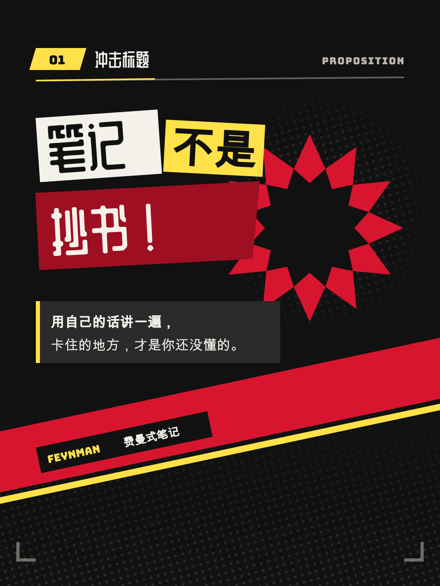
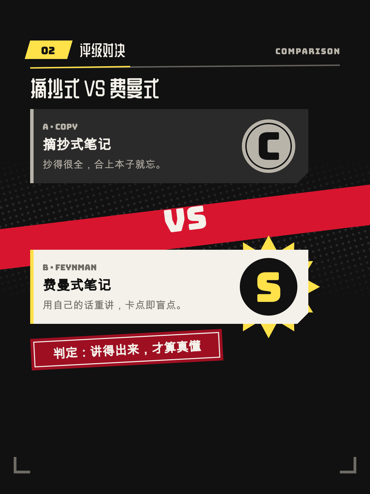
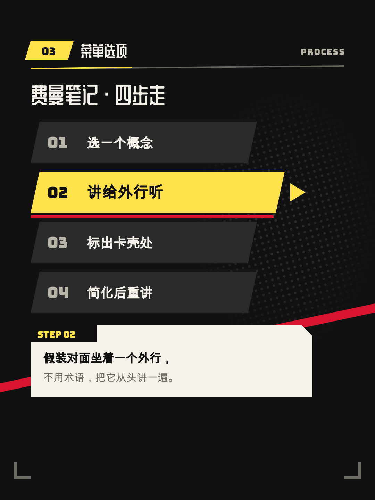
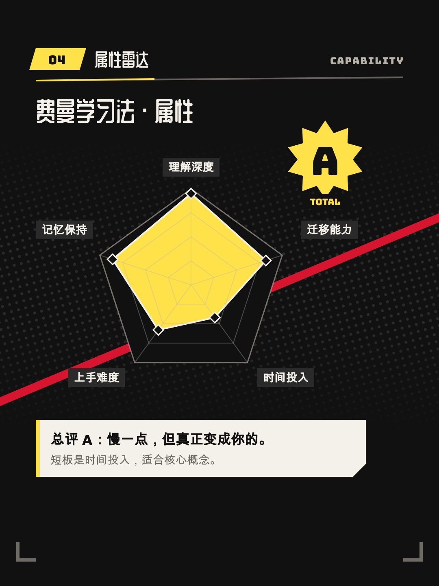
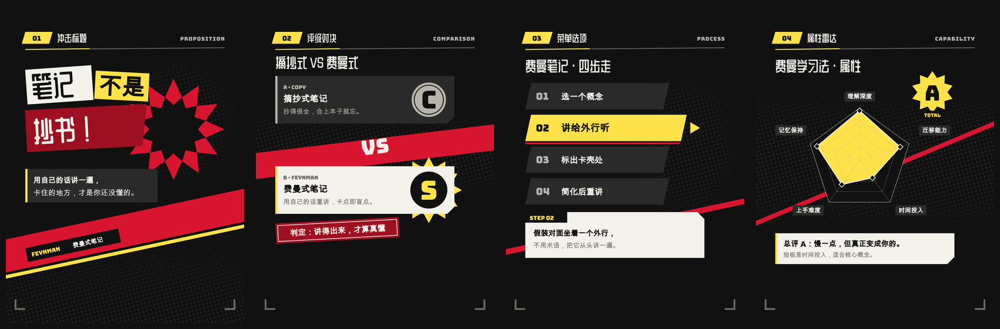

# “二次元锐利拼贴”视频风格说明书

- 版本：1.0
- 适用：强观点、排行与评级、角色化讲解、游戏与动画文化、反常识结论类竖屏解说
- 基准画幅：1080×1440，30fps

## 1. 风格定位

“二次元锐利拼贴”借用动画风 JRPG 菜单与平面拼贴海报的共同语汇：斜切色板、剪贴字块、网点、星芒、评级字母和属性雷达。它把一个观点当成一次“出招”：先斩出命题，再亮出评级，最后把结论盖章锁定。

五个关键词：

- **锐利**：直角、斜切、硬边，不用圆角与柔和阴影。
- **有态度**：每镜只下一个判断，用评级与盖章把判断说死。
- **节奏干脆**：快进、轻微过冲、硬停；落定后文字保持静止。
- **高对比**：墨黑、纸白、打击黄三色主轴，斩击红只做大面积色块。
- **可读**：拼贴只装饰标题层，正文永远落在干净的底板上。

### 与商业作品的边界

本风格参考的是一类游戏界面的**共同特征**，不是任何一款作品。以下内容一律禁止：

- 复刻某款商业游戏的菜单布局、Logo、角色剪影、专有图标或标志性字形。
- 以红黑为唯一主色、整屏剪报字拼成菜单的“某作同款”画面。本风格以**黄**为第一强调色，红只是第二层斩击色，正是为了和那类配色拉开距离。
- 使用任何游戏、动画的角色立绘、截图或台词作为装饰；若作为内容素材出现，必须是文案明确讨论的对象，并放进纸白素材框。

## 2. 适用与不适用

适合：

- “X 被高估了”“三个误区”这类强观点、反常识结论。
- 排行榜、梯队评级、两方对决与优劣对比。
- 把工具、方法或概念“角色化”，讲它的属性与短板。

不适合直接套用：

- 严肃新闻、医疗与灾难等需要克制情绪的内容。
- 需要长段正文或精确表格核对的教学内容；这类内容应换用更安静的风格。

## 3. 品牌叙事原则

每个镜头先写一句体验描述，再写布局：

> 这一刀斩出的判断是什么？先亮出什么，后亮出什么？最后盖在哪个章上？

优先使用以下叙事动作：

1. **亮招**：斜切色板斩入，带出命题或问题。
2. **拆招**：展开两方、选项或维度。
3. **评级**：给出评级字母、分数或排名。
4. **盖章**：结论以印章或黄底字块落定。
5. **收刀**：短暂停留后硬切或斜切转场。

## 4. 画布、安全区与网格

### 4.1 安全区

以根目录 `frame.md` 的 `safe_area` 为准。`structural` 区可放斜切色带、网点和星芒；`main_content` 区放普通图形；标题、数字、评级和结论只能放在 `critical_text` 区；封面标题使用 `cover_title` 区；内嵌字幕使用 `subtitles` 区。

右侧互动栏与底部 UI 的避让区里只允许出现非关键装饰。

### 4.2 斜线与主轴

- 主内容左轴 88px，标准宽度 904px。
- 全片主斜线角度统一为 -12° 到 -18°（左低右高）。同一镜头只有一个斜切方向。
- 拼贴字块允许 ±4° 的小角度错落，但同一行不超过三块。
- 不追求居中对称；用一条贯穿画面的斜切带把画面分成“攻”与“守”两半，建立视线运动。

## 5. 色彩系统

| Token | 色值 | 用途 |
|---|---|---|
| canvas / ink | `#111111` | 墨黑底、纸白板上的文字 |
| plate_charcoal | `#2A2A2A` | 次级墨黑板、未选中菜单项 |
| paper | `#F4F1EA` | 纸白字块、正文底板、墨黑底上的主文字 |
| white | `#FFFFFF` | 斩击高光、星芒芯 |
| strike_yellow | `#FFE14A` | 第一强调：选中项、评级、结论字块 |
| slash_red | `#D8152F` | 第二强调：大面积斜切色板、46px 以上白字标题底 |
| deep_red | `#9E0F22` | 可放任意字号纸白字的红色板、印章 |
| halftone_gray | `#B9B4AA` | 墨黑底上的次级文字、网点 |
| muted_ink | `#6E6A63` | 纸白底上的次级文字 |

### 5.1 对比规则（WCAG 2.x 对比度）

| 文字 / 底 | 对比度 | 允许 |
|---|---:|---|
| 纸白 / 墨黑 | 16.7:1 | 任意字号 |
| 墨黑 / 打击黄 | 14.5:1 | 任意字号 |
| 纸白 / deep_red | 7.3:1 | 任意字号 |
| 墨黑 / halftone_gray | 9.2:1 | 任意字号 |
| muted_ink / 纸白 | 4.8:1 | 24px 以上次级说明 |
| 纸白 / slash_red | 4.6:1 | 仅 46px 以上标题 |
| 墨黑 / slash_red | 3.7:1 | **禁止** |

打击黄是唯一的“选中”色，每个信息镜头至少出现一次，但不铺满整屏。斩击红与 deep_red 是色块，不作为文字色使用。

## 6. 字体与信息层级

### 6.1 字体角色

- 展示字：`ZCOOL QingKe HuangYou`（`typography.display_stack`），用于封面、镜头标题、评级词、印章；正文用 `typography.primary_stack`（Noto Sans SC）。
- 英文与数字：`Bungee`（`typography.mono_stack`），用于评级字母、编号、分数、英文小标签。
- 正文：`Noto Sans SC` 400 / 700，用于所有 36px 以下的中文句子与字幕。展示字不用于正文。
- 剪贴字块：`Noto Sans SC` 900 与展示字混排，只出现在标题层。

所有字体都随项目下发，必须用 `@font-face` 显式加载，不依赖系统字体。

### 6.2 字号

| 角色 | 字号 | 字体 |
|---|---:|---|
| 封面标题 | 88–128px | ZCOOL QingKe HuangYou |
| 镜头标题 | 52–76px | ZCOOL QingKe HuangYou |
| 正文 / 结论 | 26–36px | Noto Sans SC 400–700 |
| 标签 / 编号 | 22–28px | Bungee 或 Noto Sans SC 700 |
| 评级字母 | 120px 以上 | Bungee |

中文正文不小于 24px。标题行距 0.96–1.06，正文约 1.38。不使用渐变文字、描边空心字或霓虹发光字。

## 7. 空间与形状

### 7.1 留白节奏

- 同组元素：12–20px。
- 堆叠菜单项：至少 14px。
- 不同信息组：32–60px。
- 主板内边距：28–40px；次级板：22–28px。
- 标签、编号、评级徽章距边缘：至少 22px。
- 列表、菜单最后一项到底边：至少 22px。

### 7.2 形状

- 所有板块都是直角或斜切角（切角 18–40px），**不使用圆角卡片**。
- 圆形只用于评级徽章与雷达图，`pill_px` 仅为圆形徽章保留。
- 星芒使用 8–12 个尖角的放射多边形，只作为评级或结论的背衬。
- 网点使用规则排列的圆点图案，只放在墨黑底或纯色块上，不放在正文下面。

## 8. 组件语言

### 斜切色板

一块跨越画面的斜向矩形，承载镜头的“攻击方向”。每镜最多一大一小两块。

### 剪贴字块

标题拆成 2–3 个字块，每块有自己的底板（纸白、打击黄或墨黑），轻微错位旋转。字块只在标题层使用，正文不拼贴。

### 菜单项

直角长条，左侧编号用 Bungee。选中项为打击黄底墨黑字、向右突出 24–40px 并带一个三角指针；未选中项为炭黑底纸白字。

### 评级徽章

圆形或星芒背衬 + Bungee 字母（S / A / B / C），配一个纸白小标签说明含义。评级只能有一个主徽章。

### 属性雷达

五到六轴的雷达图，轴线用 halftone_gray，填充用打击黄 70% 不透明，描边墨黑或纸白。每条轴的名称用 Noto Sans SC 700、至少 24px。

## 9. 四类镜头骨架

### 9.1 冲击标题（proposition）

用于封面、钩子、章节开场和一句话强观点。一个剪贴标题 + 一句正文，最多两个焦点。



### 9.2 评级对决（comparison）

用于两方对比、误区与真相、旧做法与新做法。斜切带把画面分成两半，各自给出评级，最后的判定单独盖章，不塞进任何一方。



### 9.3 菜单选项（process）

用于步骤、分支和排行清单。纵向菜单逐项亮起，当前项为打击黄选中态，右侧或下方给出当前项的一句说明。



### 9.4 属性雷达（capability_deck）

用于多维能力、综合评分与最终结果。雷达图是视觉锚点，配一个总评级徽章和一句结论。



## 10. 动画语法

### 10.1 三阶段

- **Build 25%**：斩入、盖章，按信息优先级入场。
- **Breathe 55%**：文字完全静止，给观众读的时间；只保留一种环境动作。
- **Resolve 20%**：盖章锁定结论，或斜切快速退场。

### 10.2 品牌动作词

- `SLASH`：斜切色板沿主斜线划入，0.16–0.30s，expo.out。
- `SLAM`：标题字块从 1.3 倍缩放砸到 1.0，轻微过冲后硬停。
- `CUT IN`：剪贴字块逐块插入，块间错开 0.04–0.08s。
- `STAMP`：印章或评级从 1.6 倍缩到 1.0，落定时可配一次 IMPACT SHAKE。
- `SNAP`：菜单选中框瞬间跳到新选项，0.12–0.18s。
- `IMPACT SHAKE`：整组位移 ≤12px、≤0.20s 的单次抖动，只用于关键落点。
- `RANK UP`：评级字母从低档快速翻到最终档后停住。

入场 0.16–0.40s，使用 expo.out、power4.out 或 back.out(1.6)；退场 0.12–0.28s，使用 ease-in。第一动作延迟 0.10–0.25s，避免第 0 帧跳变。

### 10.3 转场

- 同一论点内：斜切色板扫过画面完成切换，0.12–0.30s。
- 新章节或观点反转：硬切，允许一次 IMPACT SHAKE。
- 重要信息落定后稳定 1.0–1.8s，再允许切镜头。

禁止弹簧、橡皮筋、持续晃动、全屏闪白、频闪，以及文字在被阅读时移动。

## 11. 字幕、口播与声音

### 字幕

- 可选，最多两行，32–38px，最大宽度 812px，行距 1.30–1.40。
- 每行建议不超过 16 个全角字符；专有名词、英文词组、数字与单位不可拆开。
- 使用 `rgba(17,17,17,0.90)` 直角底、纸白 Noto Sans SC 文字、14×22px 内边距。
- 字幕不得遮挡评级徽章、雷达图、菜单选中项和结论印章。

### 口播

- 保持人声原速；观点句之后留真实停顿，让盖章落在停顿上。

### BGM 与 SFX

- 48kHz 双声道；人声 stem 建议 -18 至 -16 LUFS。
- BGM 可以更有律动感，但建议 -30 至 -26 LUFS；有人声时下压 6–10dB。
- ducking attack 0.04–0.12s，release 0.25–0.60s；BGM 淡入淡出 0.80–1.50s。
- SFX 只给斩击、盖章、评级揭晓与结论，单个 cue 增益 -18 至 -12dB，同时最多两个。
- 成片目标 -16 LUFS ±1，真峰值不高于 -1 dBTP，LRA 2–6 LU。

## 12. 首帧封面

- 第 0 帧必须是完整完成态：剪贴标题、斜切色板和星芒全部就位。
- 默认两行，最多三行；单行不超过 8 个全角字符，字号 88–128px，最大宽度 812px。
- 文本与底板最低对比度 7:1：纸白字配墨黑或 deep_red 底，墨黑字配纸白或打击黄底。
- 30fps 下至少稳定 18 帧后才允许转场，不得以斩击进行中的中间态开场。

## 13. 不可变项与可变项

### 不可变

- 画布、核心色、字体角色、安全区、直角形状和斜线角度范围。
- 四类骨架的语义用途。
- 动作词、三阶段节奏、人声优先的声音目标。
- 对比规则、字幕、封面、禁用项和验收门槛。

### 可变

- 骨架选择与组合、评级档位与维度数量、局部构图。
- 网点密度、星芒尖角数、剪贴字块的拆分方式。
- 内容素材（截图、产品图），须放进纸白素材框。

## 14. Do / Don't

### Do

- 每镜只下一个判断，用评级或盖章把它说死。
- 让标题层热闹、正文层安静。
- 落定后让文字完全静止，给足阅读时间。
- 用打击黄标记“选中”和“结论”，用斩击红制造方向感。

### Don't

- 不复刻任何商业游戏的界面、Logo、角色或字形。
- 不在斩击红上放小号黑字，不在网点上放正文。
- 不用圆角卡片、柔和阴影、渐变字和霓虹发光。
- 不做持续晃动、频闪、全屏闪白或弹簧回弹。
- 不让每个元素都配 SFX，不让 BGM 盖住观点句。

## 15. 制作与验收清单

### 制作前

- [ ] 明确本镜头属于哪种骨架。
- [ ] 写出这一刀斩出的判断和最后盖的章。
- [ ] 标出主焦点的登场顺序（整镜最多两个）和三个景深层次。
- [ ] 核对关键文字安全区。

### 画面

- [ ] 色值全部来自 token，单镜不超过三种色相。
- [ ] 小号文字只落在纸白、墨黑、打击黄或 deep_red 底板上。
- [ ] 正文只用 Noto Sans SC，且不小于 24px。
- [ ] `typography.font_files` 用到的每个字重都有 `@font-face`，`src` 指向镜头目录内真实存在的文件，且都是 `font-display: block`。渲染机不装系统字体，漏一条会静默回退成通用字体，本地看不出来。
- [ ] 标签、评级徽章距边缘至少 22px；菜单底部至少 22px。
- [ ] 无商业游戏的 Logo、角色、截图或专有界面。

### 动画

- [ ] Build / Breathe / Resolve 完整，Breathe 阶段文字静止。
- [ ] 入场顺序符合信息优先级。
- [ ] IMPACT SHAKE 只用于关键落点。
- [ ] 每镜头最多一种环境动作。
- [ ] 动画确定性、可寻址、任意帧可重建。

### 声音与交付

- [ ] 人声清晰且保持原速。
- [ ] BGM ducking 和淡入淡出正确。
- [ ] SFX 只落在斩击、盖章与评级上。
- [ ] 第 0 帧完成并稳定至少 18 帧。
- [ ] 1080×1440、30fps、H.264/yuv420p/BT.709。

## 16. 可复制镜头提示词模板

```text
使用“二次元锐利拼贴”风格制作本镜头。

品牌层必须读取并遵守项目根目录 frame.md：
- 不改核心色、字体角色、安全区、间距、直角形状、动作语法和声音目标。
- 根据当前文案从 proposition / comparison / process / capability_deck 中选择最合适的骨架。
- 镜头内部图形隐喻、评级档位、局部构图和动画由你根据语义设计。
- 同一时刻只有一个主焦点；整镜最多两个焦点，按节拍依次登场；背景/中景/前景三个层次。
- 使用 SLASH / SLAM / CUT IN / STAMP / SNAP / RANK UP 等快速、硬停的动作；文字落定后保持静止。
- 不在斩击红上放小号黑字；正文只用 Noto Sans SC；不复刻任何商业游戏界面、Logo 或角色。
- 输出 1080×1440、30fps、静音、无音轨 MP4。

镜头文案：
{{SCENE_TEXT}}

镜头时长：
{{SCENE_DURATION_SECONDS}}
```

## 17. 通用验证资产

四类通用骨架联系表：



机器使用时，以根目录 [`frame.md`](../frame.md) 的 YAML frontmatter 为规范性来源。
