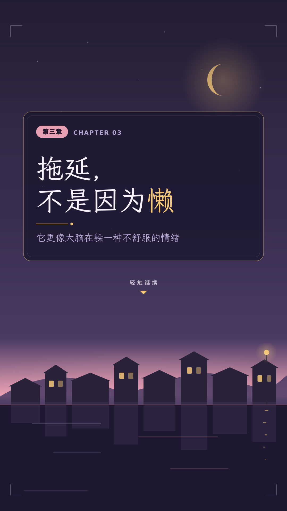
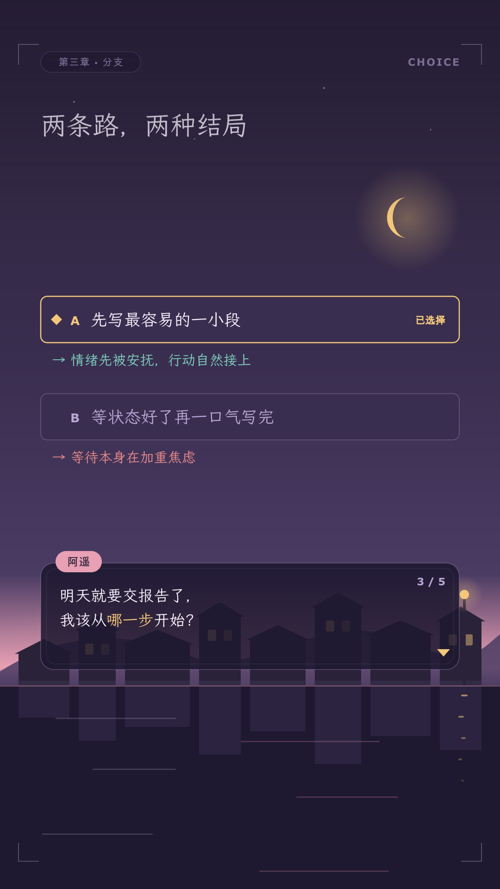
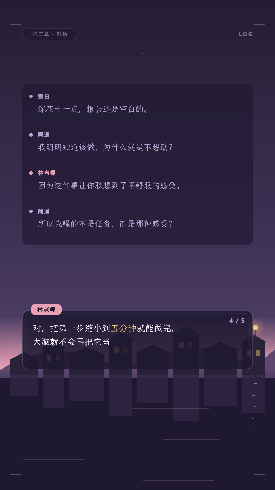
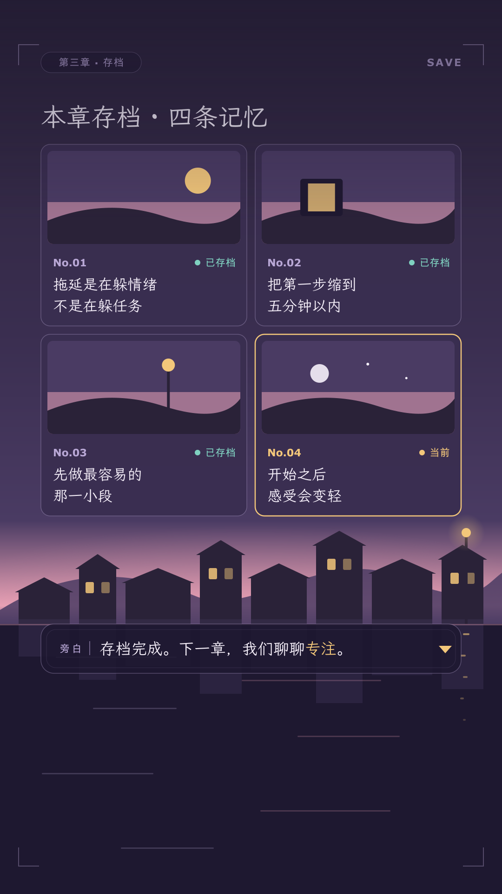
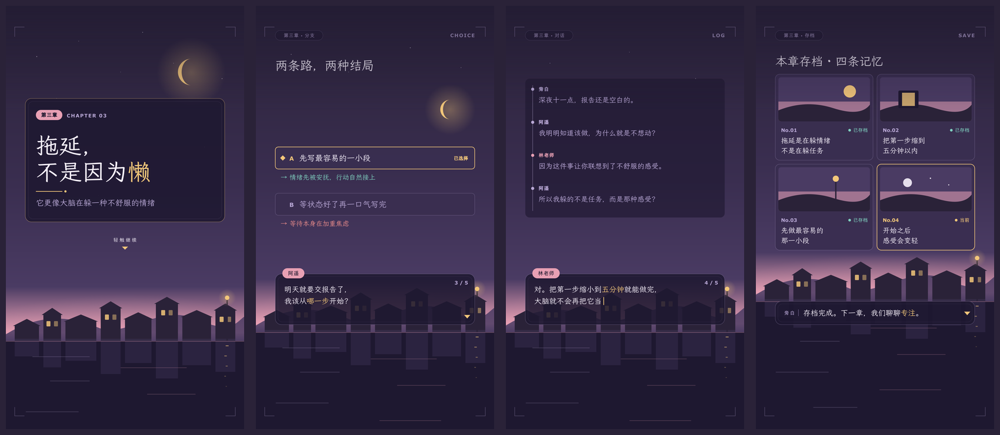

---
schema_version: 1
style_id: visual-novel-v1
style_name: 视觉小说对话
scope:
  - story_driven_explainer
  - dialogue_format_explainer
  - emotion_and_relationships
  - character_and_history_stories
  - reflective_personal_growth
canvas:
  width_px: 1080
  height_px: 1920
  fps: 30
  orientation: vertical
safe_area:
  structural: {left_px: 40, right_px: 40, top_px: 96, bottom_px: 60}
  main_content: {left_px: 88, right_px: 88, top_px: 120, bottom_px: 100}
  critical_text: {left_px: 88, right_px: 180, top_px: 120, bottom_px: 260}
  cover_title: {left_px: 88, right_px: 180, top_px: 260, bottom_px: 940}
  subtitles: {left_px: 88, right_px: 180, top_px: 1470, bottom_px: 260}
colors:
  canvas: "#2A2238"
  dusk_violet: "#4A3B63"
  horizon_rose: "#E8A0B4"
  dialogue_box: "#1E1830"
  choice_panel: "#3A2E50"
  paper: "#F6F0FA"
  mist_lavender: "#B9A8D6"
  lantern_gold: "#F3C77A"
  ink: "#221A30"
  warning_coral: "#E88A8A"
  memory_mint: "#7FD1C0"
typography:
  primary_stack: '"LXGW WenKai", "Noto Sans SC", sans-serif'
  mono_stack: '"Noto Sans SC", sans-serif'
  font_files:
    - {family: "Noto Sans SC", weight: 400, file: "assets/fonts/noto-sans-sc-400.woff2"}
    - {family: "Noto Sans SC", weight: 600, file: "assets/fonts/noto-sans-sc-600.woff2"}
    - {family: "Noto Sans SC", weight: 700, file: "assets/fonts/noto-sans-sc-700.woff2"}
    - {family: "Noto Sans SC", weight: 900, file: "assets/fonts/noto-sans-sc-900.woff2"}
    - {family: "LXGW WenKai", weight: 400, file: "assets/fonts/lxgw-wenkai-400.woff2"}
  sizes_px:
    cover_min: 80
    cover_max: 112
    title_min: 48
    title_max: 66
    body_min: 30
    body_max: 38
    label_min: 22
    label_max: 26
  weights:
    display: 400
    heading: 400
    body: 400
    body_emphasis: 400
    metadata: 700
  line_heights:
    display_min: 1.08
    display_max: 1.18
    body: 1.55
    metadata: 1.2
spacing:
  content_left_px: 88
  content_width_px: 904
  group_min_px: 14
  group_max_px: 22
  card_stack_min_px: 18
  card_main_padding_min_px: 32
  card_main_padding_max_px: 40
  card_secondary_padding_min_px: 22
  card_secondary_padding_max_px: 28
  section_min_px: 32
  section_max_px: 60
  element_edge_min_px: 22
  skeleton_bottom_min_px: 22
radius:
  sm_px: 8
  md_px: 14
  lg_px: 20
  xl_px: 28
  pill_px: 999
scene_archetypes:
  - id: proposition
    name: 章节标题卡
    use_for: 封面、钩子、章节开场、强结论
    example_png: assets/style-guide/examples/proposition.png
  - id: comparison
    name: 分支选择
    use_for: 两种做法、两种观点、选择与后果、旧路与新路
    example_png: assets/style-guide/examples/comparison.png
  - id: process
    name: 对话推进
    use_for: 一问一答、步骤讲解、因果推进、状态变化
    example_png: assets/style-guide/examples/process.png
  - id: capability_deck
    name: 存档卡册
    use_for: 要点回顾、多条经验、阶段成果、全片总结
    example_png: assets/style-guide/examples/capability_deck.png
motion:
  phases: {build: 0.30, breathe: 0.45, resolve: 0.25}
  entrance_seconds: {min: 0.35, max: 0.70}
  exit_seconds: {min: 0.25, max: 0.50}
  transition_seconds: {min: 0.30, max: 0.60}
  first_action_delay_seconds: {min: 0.10, max: 0.30}
  entrance_ease: [power1.out, power2.out, sine.out]
  exit_ease: [power1.in, power2.in, sine.in]
  verbs: [FADE_IN, TYPE, SPEAK, CHOOSE, ADVANCE, TURN_PAGE, SAVE]
  ambient_per_scene_max: 1
  max_same_ease_tweens: 2
audio:
  sample_rate_hz: 48000
  channels: 2
  voice_integrated_lufs: {min: -18, max: -16}
  bgm_integrated_lufs: {min: -30, max: -26}
  bgm_ducking_db: {min: 6, max: 10}
  ducking_attack_seconds: {min: 0.04, max: 0.12}
  ducking_release_seconds: {min: 0.25, max: 0.60}
  bgm_fade_seconds: {min: 0.80, max: 1.50}
  sfx_gain_db: {min: -18, max: -12}
  sfx_max_simultaneous: 2
  final_integrated_lufs: -16
  final_lufs_tolerance: 1
  true_peak_max_dbtp: -1
  lra_lu: {min: 2, max: 6}
subtitles:
  required: false
  font_size_px: {min: 32, max: 38}
  max_width_px: 812
  max_lines: 2
  max_fullwidth_chars_per_line: 16
  line_height: {min: 1.30, max: 1.40}
  background: "rgba(30, 24, 48, 0.88)"
  text_color: "#F6F0FA"
  padding_px: {vertical: 14, horizontal: 22}
  radius_px: 14
  break_rules:
    - keep_proper_nouns_intact
    - keep_english_phrases_intact
    - keep_numbers_and_units_intact
    - preserve_real_speech_gaps
cover:
  frame_zero_complete: true
  default_lines: 2
  max_lines: 3
  max_fullwidth_chars_per_line: 10
  font_size_px: {min: 80, max: 112}
  line_height: {min: 1.08, max: 1.18}
  max_width_px: 812
  contrast_ratio_min: 7.0
  stable_frames: 18
forbidden:
  - black_or_blank_frame_zero
  - cover_fade_in_intermediate_state
  - copying_commercial_game_ip_characters_or_logos
  - copying_specific_commercial_game_ui
  - character_sprites_or_faces_of_real_or_ip_characters
  - dialogue_box_overlapping_subtitle_band
  - dialogue_text_outside_critical_text_area
  - typewriter_slower_than_narration
  - per_character_sound_blips_over_voice
  - fully_transparent_dialogue_box
  - photographic_or_ai_generated_backgrounds
  - arbitrary_new_brand_colors
  - gradient_text
  - elastic_or_bouncy_motion
  - screen_shake_or_flash_cuts
  - continuous_particle_storms
  - labels_or_icons_touching_edges
  - music_masking_voice
---# “视觉小说对话”视频风格说明书

- 版本：1.0
- 适用：故事化讲解、对话体科普、情感与人际、人物与历史故事、成长与反思类竖屏解说
- 基准画幅：1080×1920，30fps

## 1. 风格定位

“视觉小说对话”借用视觉小说（ADV / galgame）的阅读体验来讲解内容：一幅安静的氛围场景，一只半透明对话框，一个名牌，一句被慢慢打出来的台词。观众不是在“看信息图”，而是在“读一段对话”。

五个关键词：

- **代入**：用发问者与回答者的对话推进观点，观众站在发问者一侧。
- **从容**：一句一停，读完再推进，不抢口播。
- **氛围**：黄昏与夜色的矢量场景提供情绪，但永远压在文字之下。
- **可读**：文字只落在对话框或实色面板上，对比度按实色计算。
- **原创**：只借用品类的界面语法，不借用任何具体作品的角色、Logo 与界面。

## 2. 适用与不适用

适合：

- 故事、人物、历史、心理、人际关系类选题。
- 把一篇文章改写成“两个人聊天”的对话体讲解。
- 需要情绪铺垫、选择与后果的内容（例如“两种做法，结局不同”）。

不适合直接套用：

- 数据密集、需要大量数字对照的评测和报表。
- 需要精确流程图、架构图的技术讲解。
- 快节奏、强刺激的促销与热点快讯。

这些题材若要使用本风格，应把数据收进存档卡册或选择按钮里，每屏只留一条结论。

## 3. 叙事原则

每个镜头先写一句“台词”，再写布局：

> 此刻是谁在说话？他说的哪一句必须被观众读到？读完后画面停在哪里？

优先使用以下叙事动作：

1. **开章**：章节标题卡点明本段主题。
2. **发问**：发问者（通常是“你”或一位同伴）提出观众心里的疑问。
3. **回答**：回答者用一句话给出判断，关键词用灯笼金。
4. **抉择**：给出两条路，高亮其中一条，说明后果。
5. **存档**：把本段结论收进一张存档卡，作为可以回看的记忆。

## 4. 画布、安全区与对话框位置

### 4.1 五层安全区

以 frontmatter 的 `safe_area` 为准；它由画幅推导为绝对像素。

| 区域 | 用途 |
|---|---|
| `structural` | 场景边缘、暗角、页码与细装饰 |
| `main_content` | 场景道具、存档卡、选择按钮 |
| `critical_text` | 台词、章节名、结论、关键词 |
| `cover_title` | 第 0 帧章节标题卡 |
| `subtitles` | 可选内嵌字幕 |

### 4.2 对话框落点

视觉小说的对话框习惯贴在屏幕最下方，但竖屏平台的底部是字幕带和平台 UI。本风格把对话框整体上移：

- 对话框下边缘 ≤ `safe_area.subtitles.top_px` − 24px。
- 对话框左右与 `main_content` 对齐，框内文字在 `critical_text` 的右边界内换行（避让右侧互动栏和底部 UI）。
- 对话框高度 230–300px，正文最多三行。
- 名牌胶囊压在对话框左上边缘，向上探出约一半高度。
- 字幕带保持空白或只放场景地面，不放任何界面元素。

在 3:4 画幅中，对话框通常落在 y≈690–966；在 9:16 画幅中通常落在 y≈1150–1446，多出的高度留给场景与卡片；在 16:9 横屏中通常落在 y≈600–820，横向占满关键文字区。

## 5. 色彩系统

| Token | 色值 | 用途 |
|---|---|---|
| canvas | `#2A2238` | 夜幕紫，场景最底层 |
| dusk_violet | `#4A3B63` | 暮色中景：远山、窗框、云带 |
| horizon_rose | `#E8A0B4` | 晚霞、地平线、名牌底 |
| dialogue_box | `#1E1830` | 对话框与深色面板（以约 0.86 不透明度叠放） |
| choice_panel | `#3A2E50` | 选择按钮、存档卡底 |
| paper | `#F6F0FA` | 台词、标题正文 |
| mist_lavender | `#B9A8D6` | 旁白、辅助说明、未选中项 |
| lantern_gold | `#F3C77A` | 关键词、选中描边、推进三角、月亮 |
| ink | `#221A30` | 浅色名牌和金色按钮上的文字 |
| warning_coral | `#E88A8A` | 坏结局、风险、错误选择 |
| memory_mint | `#7FD1C0` | 已存档、完成、好结局 |

### 5.1 对比度（按等效实色计算）

对话框是半透明的，不能拿 `#1E1830` 直接算。以 0.86 不透明度叠在画面最亮的 `paper` 上时，等效实色约为 `#3C364C`，此时：

| 文字 | 等效底色 | 对比度 |
|---|---|---:|
| paper `#F6F0FA` | `#3C364C` | ≈ 10.3 |
| lantern_gold `#F3C77A` | `#3C364C` | ≈ 7.3 |
| mist_lavender `#B9A8D6` | `#3C364C` | ≈ 5.3 |
| ink `#221A30` 于 horizon_rose | `#E8A0B4` | ≈ 8.0 |
| ink `#221A30` 于 lantern_gold | `#F3C77A` | ≈ 10.5 |
| warning_coral `#E88A8A` | `#3C364C` | ≈ 4.6 |
| memory_mint `#7FD1C0` | `#3C364C` | ≈ 6.5 |

这是最坏情况。实际场景更暗，对比度只会更高。不透明度不得低于 0.80；低于这个值要重新计算。

晚霞粉和灯笼金是少量点缀：同一屏里二者的面积加起来不超过画面的十分之一。警示珊瑚和记忆薄荷是语义色，只表示“坏/好”，不作装饰轮换。

## 6. 字体与信息层级

### 6.1 字体角色

- 台词、章节名、标题、结论：`LXGW WenKai`（霞鹜文楷）400。它是唯一字重，强调靠颜色与字号，不用伪加粗。
- 界面标签、按钮编号、存档时间、页码：`Noto Sans SC` 600/700。
- 两种字体都必须显式嵌入，不依赖渲染机的系统字体。

### 6.2 字号

| 角色 | 字号 | 字重 |
|---|---:|---:|
| 封面 / 章节标题 | 80–112px | 400（文楷） |
| 镜头标题 | 48–66px | 400（文楷） |
| 台词 / 结论 | 30–38px | 400（文楷） |
| 名牌 / 标签 / 元数据 | 22–26px | 600–700（黑体） |

标题行距 1.08–1.18，台词行距约 1.55——文楷笔画细长，行距比黑体大一档才透气。任何中文正文不小于 24px。

## 7. 空间与圆角

### 7.1 留白

- 同组元素：14–22px。
- 堆叠卡片或按钮：至少 18px。
- 不同信息组：32–60px。
- 对话框内边距：32–40px。
- 次级卡内边距：22–28px。
- 标签、页码、图标距边缘：至少 22px。
- 列表、卡册最后一行到底边：至少 22px。

### 7.2 圆角

- 8px：小标签、存档编号。
- 14px：选择按钮、字幕底。
- 20px：存档卡、次级面板。
- 28px：对话框、章节标题卡。
- 999px：名牌、状态胶囊。

## 8. 组件语言

### 对话框

`dialogue_box` 0.86 不透明度底，1.5px `mist_lavender` 细描边（约 0.35 不透明度），内侧可有一条更细的内框线。右下角是金色推进三角，整句打完后才出现。

### 名牌

`horizon_rose` 胶囊，`ink` 文字，黑体 600，压在对话框左上边缘。旁白不配名牌。

### 选择按钮

`choice_panel` 底，14px 圆角，左侧编号。被选中的一项：描边与编号变为 `lantern_gold`，左侧出现小菱形光标；另一项降为 `mist_lavender` 文字。

### 章节标题卡

大号文楷标题、细金线、章节编号胶囊。背景是完整场景，不是纯色。

### 存档卡

`choice_panel` 底卡片，上方是一块“缩略场景”（纯矢量小画面），下方是存档编号、时间感标签和一句结论。已存档用 `memory_mint` 小圆点标记。

### 场景道具

月亮、路灯、窗、书桌、远山、云带、星点。只用渐变与几何，轮廓简洁；人物只允许无五官的剪影。

## 9. 四类镜头骨架

### 9.1 章节标题卡（proposition）

用于封面、钩子、章节开场和强结论。完整场景 + 章节编号 + 一句大标题 + 一句副标题。第 0 帧就是它的完成态。



### 9.2 分支选择（comparison）

用于两种做法、两种观点、选择与后果。对话框提出问题，两个选择按钮纵向排列，其中一个被高亮；后果用一句台词或一行语义色小字给出，不塞进按钮。



### 9.3 对话推进（process）

用于一问一答、步骤讲解和因果推进。上方是“对话记录”（已读的前几句，文字降为薰衣草色），下方对话框是当前正在打字的一句。步骤感来自对话一句句推进，而不是项目符号列表。



### 9.4 存档卡册（capability_deck）

用于要点回顾、多条经验和全片总结。2×2 存档卡网格，每张卡是一条结论；最后一张可为“当前存档”，用金色描边标出。



## 10. 动画语法

### 10.1 三阶段

- **Build 30%**：场景淡入已在上一镜完成时可直接开始；名牌 → 对话框 → 台词依次出现。
- **Breathe 45%**：台词打完，推进三角出现，画面静止或只保留一种环境动作。
- **Resolve 25%**：选择确认、存档落定或翻页退场。

### 10.2 品牌动作词

`FADE IN`、`TYPE`、`SPEAK`、`CHOOSE`、`ADVANCE`、`TURN PAGE`、`SAVE`。

入场 0.35–0.70s，退场 0.25–0.50s，只用 `power1` / `power2` / `sine` 这类柔和缓动。第一动作延迟 0.10–0.30s。一个镜头中相同 ease 的独立 tween 不超过两个。

### 10.3 打字机与口播的关系

- 打字速度 8–14 字/秒。中文口播约 4–5 字/秒，所以打字机天然领先；要保证台词在配音说完这句**之前**已经完整显示。
- 逗号、句号处可停 0.12–0.25s，让节奏像“在说话”而不是机关枪。
- 一句打完后至少静止 1.0s 再推进，推进三角在这段时间出现。
- 用时间计算显示字数（`Math.floor(t * cps)`），不使用逐帧累加，保证任意帧可重建。
- 长于三行的句子拆成两页，用 ADVANCE（旧页淡出 0.25s，新页开始打字）衔接。

### 10.4 环境动作（三选一，最多一种）

- 云带或星点极慢横移（整镜位移不超过 40px）。
- 路灯或窗光轻微明暗呼吸。
- 推进三角上下轻移 6px。

读完后允许画面完全静止，这是本风格节奏的一部分。

### 10.5 转场

- 同一场对话：只换对话框内容，场景不动。
- 换场景或换章节：交叉淡化 0.30–0.60s，或“翻页”横向推移。
- 禁止弹跳、震屏、闪白、粒子风暴和故障效果。

## 11. 字幕、口播与声音

### 字幕

- 可选，最多两行，32–38px，最大宽度 812px，行距 1.30–1.40。
- 推荐 `rgba(30,24,48,0.88)` 底、`paper` 文字、14×22px 内边距、14px 圆角。
- 字幕只在 `safe_area.subtitles` 内；它与对话框上下分离，不重叠。
- 对话框已显示同一句时，字幕可关闭，避免同一句话在屏幕上出现两次。

### 口播

- 保持人声原速；双人对话可用两种音色，但名牌必须与说话人一致。
- 句尾留画面展示时间，不用拉伸人声填时长。

### BGM 与 SFX

- BGM 用安静的钢琴、弦乐、八音盒或环境垫底，避免强鼓点。
- 不给打字机配逐字音效；它会与人声打架。
- SFX 只用于翻页、选择确认、存档和章节切换，同时最多两个。
- 响度目标见 frontmatter `audio`：人声 -18 至 -16 LUFS，BGM -30 至 -26 LUFS 并在有人声时下压 6–10dB，成片 -16 LUFS ±1、真峰值不高于 -1 dBTP。

## 12. 首帧封面

- 第 0 帧是章节标题卡的完整完成态：场景、章节编号、标题全部就位。
- 默认两行，最多三行；单行不超过 10 个全角字符；字号 80–112px。
- 标题与其背后等效底色的对比度不低于 7:1——标题应落在深色场景区域或深色面板上。
- 30fps 下至少稳定 18 帧后才允许转场。
- 不得用打字机打出封面标题，不得以黑帧、空白或淡入中间态开场。

## 13. 不可变项与可变项

### 不可变

- 画布、核心色、字体角色、安全区、间距和圆角。
- 对话框位于字幕带之上、对比度按等效实色计算。
- 四类骨架的语义用途。
- 动作词、三阶段节奏、打字机领先口播。
- 字幕、封面、禁用项和验收门槛。

### 可变

- 场景主题（黄昏街道、夜晚书房、窗边、天台、车站……）。
- 说话人名字、发问者与回答者的设定。
- 选择按钮数量（2–3 个）、存档卡数量（3–4 张）。
- 语义色的具体出现位置。

## 14. Do / Don’t

### Do

- 把观点写成一句能“说出口”的台词。
- 让场景先到位，再让名牌和台词出现。
- 读完后停住，给观众阅读时间。
- 用灯笼金只标一个关键词。
- 用抽象剪影和道具暗示人物与情绪。

### Don’t

- 不画、不描、不仿任何商业作品的角色、Logo 或具体界面。
- 不把文字直接压在渐变天空上。
- 不让对话框压进字幕带或贴底。
- 不用伪加粗的文楷、不用渐变文字。
- 不让打字机慢于口播，不配逐字音效。
- 不用弹跳、震屏、闪白和持续粒子。

## 15. 制作与验收清单

### 制作前

- [ ] 明确本镜头属于哪种骨架。
- [ ] 写出说话人和那一句必须被读到的台词。
- [ ] 标出主焦点的登场顺序（整镜最多两个）和背景/中景/前景三个层次。
- [ ] 按 `safe_area` 像素算好对话框的上下边界。

### 画面

- [ ] 色值全部来自 token。
- [ ] 字号、间距、圆角符合范围，中文正文不小于 24px。
- [ ] `typography.font_files` 用到的每个字重都有 `@font-face`，`src` 指向镜头目录内真实存在的文件，且都是 `font-display: block`。渲染机不装系统字体，漏一条会静默回退成通用字体，本地看不出来。
- [ ] 对话框在字幕带之上且至少相距 24px。
- [ ] 对话框文字按等效实色对比度 ≥ 4.5:1。
- [ ] 标签和图标距边缘至少 22px，卡册底部至少 22px。
- [ ] 画面中没有任何商业作品的角色、Logo 或特定界面。

### 动画

- [ ] Build / Breathe / Resolve 完整。
- [ ] 打字机 8–14 字/秒，领先口播，打完后至少静止 1.0s。
- [ ] 每镜头最多一种环境动作。
- [ ] 动画确定性、可寻址、任意帧可重建。

### 声音与交付

- [ ] 人声清晰且保持原速。
- [ ] BGM ducking 和淡入淡出正确。
- [ ] 无逐字打字音效，SFX 同时不超过两个。
- [ ] 第 0 帧完成并稳定至少 18 帧。
- [ ] 1080×1920、30fps、H.264/yuv420p/BT.709。

## 16. 可复制镜头提示词模板

```text
使用“视觉小说对话”风格制作本镜头。

品牌层必须读取并遵守项目根目录 frame.md：
- 不改核心色、字体角色、安全区、间距、圆角、动作语法和声音目标。
- 根据当前文案从 proposition / comparison / process / capability_deck 中选择最合适的骨架。
- 场景道具、说话人设定、局部构图和动画由你根据语义设计；不使用任何商业作品的角色、Logo 或界面。
- 同一时刻只有一个主焦点；整镜最多两个焦点，按节拍依次登场；背景/中景/前景三个层次。
- 对话框整体位于 safe_area.subtitles.top_px 之上至少 24px；台词用 LXGW WenKai，打字机 8–14 字/秒且领先口播。
- 使用 FADE IN / TYPE / SPEAK / CHOOSE / ADVANCE / TURN PAGE / SAVE 等柔和动作，读完允许静止。
- 输出 1080×1920、30fps、静音、无音轨 MP4。

镜头文案：
{{SCENE_TEXT}}

镜头时长：
{{SCENE_DURATION_SECONDS}}
```

## 17. 通用验证资产

四类通用骨架联系表：



机器使用时，以根目录 [`frame.md`](../frame.md) 的 YAML frontmatter 为规范性来源。
