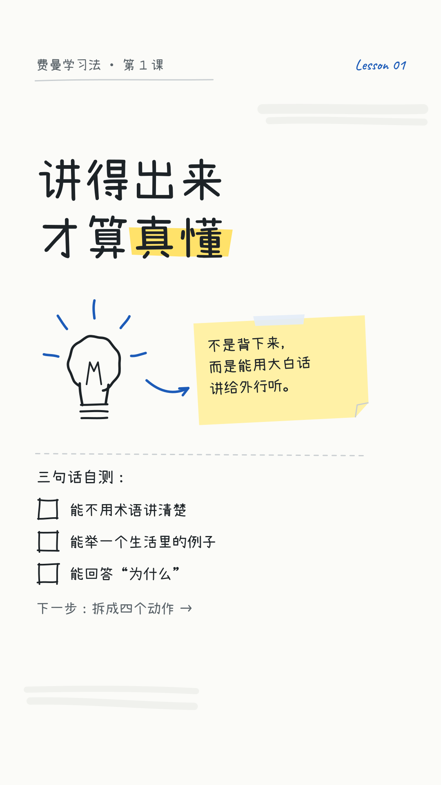
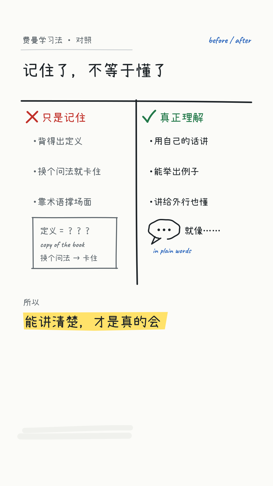
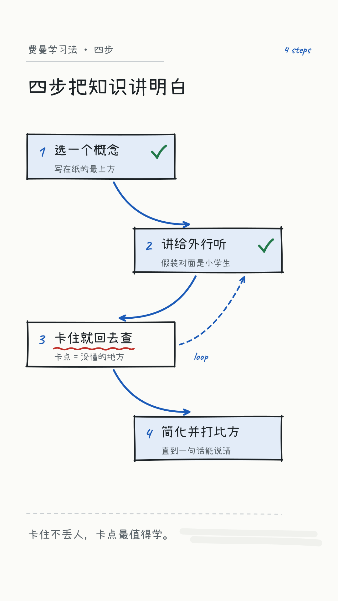
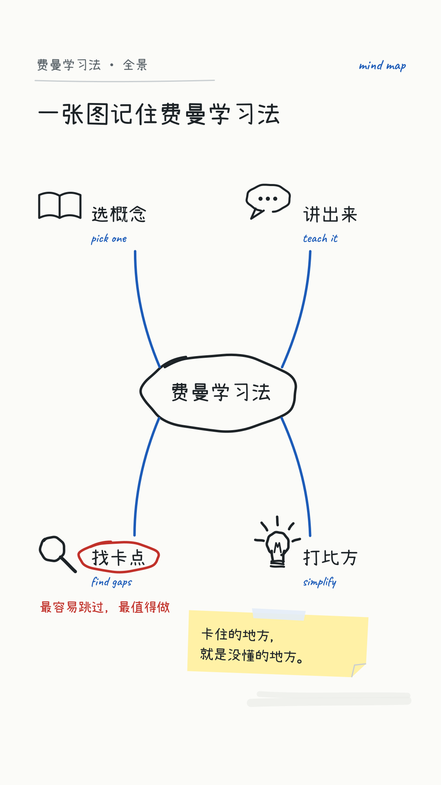
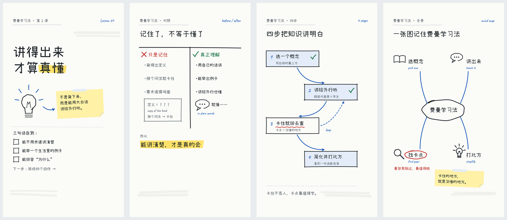

---
schema_version: 1
style_id: whiteboard-doodle-v1
style_name: 白板手绘
scope:
  - tutorial_and_how_to
  - concept_breakdown
  - classroom_style_explainer
  - learning_methods_and_habits
  - science_and_business_basics
canvas:
  width_px: 1080
  height_px: 1920
  fps: 30
  orientation: vertical
safe_area:
  structural: {left_px: 40, right_px: 40, top_px: 96, bottom_px: 60}
  main_content: {left_px: 88, right_px: 88, top_px: 120, bottom_px: 100}
  critical_text: {left_px: 88, right_px: 180, top_px: 120, bottom_px: 260}
  cover_title: {left_px: 88, right_px: 180, top_px: 260, bottom_px: 940}
  subtitles: {left_px: 88, right_px: 180, top_px: 1470, bottom_px: 260}
colors:
  canvas: "#FBFBF8"
  board_ghost: "#ECEEEA"
  ink: "#1D2327"
  marker_blue: "#1C5BB8"
  marker_red: "#C1312A"
  marker_green: "#23794A"
  highlighter: "#FFE26A"
  sticky_note: "#FFF1A6"
  blue_wash: "#E3ECF8"
  support_gray: "#596268"
  pencil_line: "#C9CED1"
typography:
  primary_stack: '"Xiaolai", "Noto Sans SC", sans-serif'
  mono_stack: '"Caveat", "Noto Sans SC", cursive'
  font_files:
    - {family: "Noto Sans SC", weight: 400, file: "assets/fonts/noto-sans-sc-400.woff2"}
    - {family: "Noto Sans SC", weight: 600, file: "assets/fonts/noto-sans-sc-600.woff2"}
    - {family: "Noto Sans SC", weight: 700, file: "assets/fonts/noto-sans-sc-700.woff2"}
    - {family: "Noto Sans SC", weight: 900, file: "assets/fonts/noto-sans-sc-900.woff2"}
    - {family: "Xiaolai", weight: 400, file: "assets/fonts/xiaolai-400.woff2"}
    - {family: "Caveat", weight: 600, file: "assets/fonts/caveat-600.woff2"}
  sizes_px:
    cover_min: 84
    cover_max: 116
    title_min: 50
    title_max: 68
    body_min: 26
    body_max: 36
    label_min: 24
    label_max: 30
  weights:
    display: 400
    heading: 400
    body: 400
    body_emphasis: 600
    metadata: 600
  line_heights:
    display_min: 1.05
    display_max: 1.18
    body: 1.40
    metadata: 1.20
spacing:
  content_left_px: 88
  content_width_px: 904
  group_min_px: 14
  group_max_px: 24
  card_stack_min_px: 20
  card_main_padding_min_px: 30
  card_main_padding_max_px: 40
  card_secondary_padding_min_px: 22
  card_secondary_padding_max_px: 30
  section_min_px: 36
  section_max_px: 64
  element_edge_min_px: 22
  skeleton_bottom_min_px: 22
radius:
  sm_px: 6
  md_px: 14
  lg_px: 24
  xl_px: 36
  pill_px: 999
scene_archetypes:
  - id: proposition
    name: 大观点
    use_for: 封面、钩子、章节开场、一句话结论
    example_png: assets/style-guide/examples/proposition.png
  - id: comparison
    name: T 形对照
    use_for: 误区与正解、之前与之后、两种做法的取舍
    example_png: assets/style-guide/examples/comparison.png
  - id: process
    name: 箭头流程
    use_for: 步骤、因果链、循环、状态变化
    example_png: assets/style-guide/examples/process.png
  - id: capability_deck
    name: 思维导图
    use_for: 概念总览、知识结构、要素拆解、一镜收束全篇
    example_png: assets/style-guide/examples/capability_deck.png
motion:
  phases: {build: 0.40, breathe: 0.40, resolve: 0.20}
  entrance_seconds: {min: 0.40, max: 0.90}
  exit_seconds: {min: 0.20, max: 0.45}
  transition_seconds: {min: 0.25, max: 0.50}
  first_action_delay_seconds: {min: 0.10, max: 0.30}
  entrance_ease: [power1.inOut, power2.out, sine.inOut]
  exit_ease: [power2.in, sine.in]
  verbs: [DRAW_ON, WRITE_ON, UNDERLINE, CIRCLE, HIGHLIGHT, POINT, STICK, ERASE]
  ambient_per_scene_max: 1
  max_same_ease_tweens: 3
audio:
  sample_rate_hz: 48000
  channels: 2
  voice_integrated_lufs: {min: -18, max: -16}
  bgm_integrated_lufs: {min: -30, max: -26}
  bgm_ducking_db: {min: 6, max: 10}
  ducking_attack_seconds: {min: 0.04, max: 0.12}
  ducking_release_seconds: {min: 0.25, max: 0.60}
  bgm_fade_seconds: {min: 0.80, max: 1.50}
  sfx_gain_db: {min: -18, max: -12}
  sfx_max_simultaneous: 2
  final_integrated_lufs: -16
  final_lufs_tolerance: 1
  true_peak_max_dbtp: -1
  lra_lu: {min: 2, max: 6}
subtitles:
  required: false
  font_size_px: {min: 32, max: 38}
  max_width_px: 812
  max_lines: 2
  max_fullwidth_chars_per_line: 16
  line_height: {min: 1.30, max: 1.40}
  background: "rgba(251, 251, 248, 0.92)"
  text_color: "#1D2327"
  padding_px: {vertical: 14, horizontal: 22}
  radius_px: 14
  break_rules:
    - keep_proper_nouns_intact
    - keep_english_phrases_intact
    - keep_numbers_and_units_intact
    - preserve_real_speech_gaps
cover:
  frame_zero_complete: true
  default_lines: 2
  max_lines: 3
  max_fullwidth_chars_per_line: 9
  font_size_px: {min: 84, max: 116}
  line_height: {min: 1.05, max: 1.18}
  max_width_px: 812
  contrast_ratio_min: 7.0
  stable_frames: 18
forbidden:
  - black_or_blank_frame_zero
  - cover_fade_in_intermediate_state
  - runtime_random_stroke_jitter
  - boiling_line_on_every_element
  - drawing_hand_or_cursor_prop
  - clip_art_or_stock_icons
  - copied_branded_whiteboard_templates
  - stick_figure_characters
  - more_than_three_marker_colors_per_scene
  - colored_text_on_highlighter
  - gradient_or_glossy_fill
  - drop_shadow_on_strokes
  - elastic_or_bouncy_motion
  - all_elements_same_direction_same_speed
  - labels_or_icons_touching_edges
  - sfx_on_every_element
  - music_masking_voice
---# “白板手绘”视频风格说明书

- 版本：1.0
- 适用：教程、方法论、概念拆解、课堂式讲解、科学与商业入门类竖屏解说
- 基准画幅：1080×1920，30fps

## 1. 风格定位

“白板手绘”把讲解还原成一堂课：老师站在白板前，一边说一边写，写到关键处用红笔圈起来，最后贴上一张便利贴收尾。观众看到的不是一张排好版的海报，而是一个正在被画出来的思路。

五个关键词：

- **耐心**：一次只写一件事，写完停一下再往下讲。
- **亲切**：手写字、轻微抖动的线条，像同桌在给你讲题。
- **清楚**：框、箭头、下划线都在指认关系，不做装饰。
- **克制**：黑笔为主，彩色马克笔少而准。
- **可追溯**：每一笔都能在口播里找到对应的那句话。

## 2. 适用与不适用

适合：

- 学习方法、工作方法、效率与习惯类教程。
- 科学原理、经济学概念、商业模型的入门讲解。
- 需要「把一个概念拆开讲」的知识视频。

不适合直接套用：

- 强情绪娱乐、奢华消费、实拍氛围为卖点的视频。
- 需要精确工程图、数据仪表或代码逐行讲解的内容（改用「清晰系统蓝图」）。

## 3. 讲解叙事原则

每个镜头先写一句体验描述，再写布局：

> 老师此刻在白板上写什么？先写哪一句，再画哪一笔？最后用什么颜色圈住结论？

优先使用以下叙事动作：

1. **写题**：用黑笔写下问题或主题。
2. **拆开**：画框、分栏、画分支，把问题拆成几块。
3. **连起来**：用箭头把块之间的因果或顺序连上。
4. **圈重点**：红笔圈、荧光笔涂、下划线，指认此刻最重要的一处。
5. **收尾**：贴一张便利贴，或打一个绿色对勾，把结论锁住。

## 4. 画布、安全区与主轴

### 4.1 五层安全区

安全区的精确像素见根目录 `frame.md` 的 `safe_area`，按 1080×1920 画幅推导，不要在镜头里另写一套数值。

| 区域 | 用途 |
|---|---|
| `structural` | 白板擦痕、页角小涂鸦、日期批注 |
| `main_content` | 手绘框、分支、便利贴、图示 |
| `critical_text` | 标题、数字、结论、核心术语 |
| `cover_title` | 第 0 帧封面标题 |
| `subtitles` | 可选内嵌字幕 |

右侧与底部的避让区是抖音互动栏与底部 UI。擦痕和弱涂鸦可以进入，标题、结论、便利贴里的文字和字幕不得进入。

### 4.2 主内容轴

- 左起 88px，标准宽度 904px。
- 白板讲解允许略微不对齐：手写标题可以相对主轴偏移 0–12px，或旋转 −2° 至 2°，但同一组元素共享同一基线。
- 不追求全画面居中；按「左上写题 → 中间展开 → 右下收尾」的书写顺序建立视线运动。

## 5. 色彩系统

| Token | 色值 | 用途 |
|---|---|---|
| canvas | `#FBFBF8` | 白板底 |
| board_ghost | `#ECEEEA` | 擦除残影、背景弱涂鸦 |
| ink | `#1D2327` | 黑色马克笔：标题、正文、框线（对 canvas 15.3:1） |
| marker_blue | `#1C5BB8` | 蓝色马克笔：箭头、结构、次级强调（对 canvas 6.3:1） |
| marker_red | `#C1312A` | 红色马克笔：圈重点、否定、错误（对 canvas 5.4:1） |
| marker_green | `#23794A` | 绿色马克笔：对勾、正确、完成（对 canvas 5.2:1） |
| highlighter | `#FFE26A` | 荧光笔涂抹，只垫在 ink 文字下（ink 对其 12.4:1） |
| sticky_note | `#FFF1A6` | 便利贴底色（ink 对其 13.9:1） |
| blue_wash | `#E3ECF8` | 淡蓝底块、分组区域 |
| support_gray | `#596268` | 辅助说明、铅笔批注（对 canvas 6.0:1） |
| pencil_line | `#C9CED1` | 铅笔辅助线、分隔线、虚线 |

规则：

- 每个镜头除 `ink` 外最多再用两种马克笔色（蓝、红、绿中选两种）；`highlighter`、`sticky_note`、`blue_wash` 是底色，不计入。
- 红、绿是语义色：红 = 否定/错误/这是重点，绿 = 正确/完成/通过。不得作为装饰色轮换。
- 彩色文字只能写在 `canvas`、`blue_wash` 或 `sticky_note` 上；荧光笔上只放 `ink` 文字（红、绿文字在荧光笔上对比度不足 4.5:1）。
- 不做渐变、光泽、投影；白板上的颜色是平涂的。

## 6. 字体与信息层级

### 6.1 字体角色

- 中文手写：`Xiaolai`（400）——标题、正文、标签、便利贴。
- 英文与数字批注：`Caveat`（600）——小注、编号、英文关键词、日期。
- 密集说明：`Noto Sans SC`（400–700）——超过三行的正文、需要精确阅读的数字表。
- 全部通过 `@font-face` 嵌入，不依赖系统字体。

### 6.2 字号

| 角色 | 字号 | 字体 |
|---|---:|---|
| 封面标题 | 84–116px | Xiaolai |
| 镜头标题 | 50–68px | Xiaolai |
| 正文 / 结论 | 26–36px | Xiaolai 或 Noto Sans SC |
| 标签 / 批注 | 24–30px | Xiaolai / Caveat |

中文正文不得小于 24px。手写体标题行距 1.05–1.18，正文约 1.40。强调用「圈、划、涂」完成，不靠加粗手写体（Xiaolai 只有一个字重）。

## 7. 线条与形状

### 7.1 笔触

- 马克笔线宽：主框 5–6px，箭头 5–7px，圈注 6–8px，铅笔辅助线 2–3px。
- 全部 `stroke-linecap: round`、`stroke-linejoin: round`，不用尖角。
- 手绘感来自路径本身：直线用两三段略带弧度的二次曲线拼成，端点略微出头或留一点缺口；圆圈不闭合，首尾交错 10–30px。
- 抖动写死在路径坐标里。禁止运行时随机抖动，也禁止让每条线都「沸腾」（boiling line）。

### 7.2 形状词汇

| 形状 | 语义 |
|---|---|
| 手绘矩形框 | 一个概念、一个步骤 |
| 双线框 / 加粗框 | 结论、最重要的一块 |
| 云朵框 | 想法、疑问、假设 |
| 便利贴（微旋转） | 补充提示、收尾金句 |
| 蓝色箭头 | 因果、顺序、流向 |
| 虚线箭头 | 可能、弱关联、待验证 |
| 红圈 / 红色波浪下划线 | 此刻重点、错误 |
| 绿色对勾 | 正确、完成 |
| 荧光笔涂抹 | 句中关键词 |

图标一律用几笔画出的简笔符号（灯泡、时钟、书本、放大镜、电池），不使用剪贴画、素材库图标或卡通人物。

### 7.3 圆角

手绘框的「圆角」来自笔触转弯的弧度：小标签 6px，常规框 14px，便利贴与大框 24px，云朵与强调框 36px，胶囊 999px。

## 8. 四类镜头骨架

### 8.1 大观点

用于封面、钩子、章节开场和一句话结论。一句大字手写判断，关键词下垫荧光笔或被红圈圈住，一张便利贴补一句解释。最多两个焦点：先大字，后圈注。



### 8.2 T 形对照

用于误区与正解、之前与之后、两种做法。画一个大写的 T：横线上写题，竖线把左右分开。左侧用红色叉号，右侧用绿色对勾；最终结论单独写在 T 下方，不塞进任何一栏。



### 8.3 箭头流程

用于步骤、因果链、循环和状态变化。手绘框沿「之」字形或纵向排列，蓝色箭头依次连接；当前步骤被红圈或荧光笔指认，完成的步骤打绿勾。不做普通项目符号列表。



### 8.4 思维导图

用于概念总览、要素拆解和一镜收束全篇。中心主题写在云朵框或双线框里，四到五条弯曲分支向外生长，每条分支末端一个关键词加一个简笔图标。分支按口播顺序依次画出，最后圈出其中一条作为重点。



## 9. 动画语法

### 9.1 三阶段

- **Build 40%**：按书写顺序画出、写出，节奏比其他风格略慢。
- **Breathe 40%**：画面可以完全静止，让观众读完；最多一种环境动作。
- **Resolve 20%**：圈重点、贴便利贴、打勾，或擦除后进入下一镜。

### 9.2 品牌动作词

| 动作 | 实现 |
|---|---|
| `DRAW_ON` | 路径 `strokeDashoffset` 从全长到 0，框线与箭头 0.4–0.9s |
| `WRITE_ON` | 文字自左向右遮罩展开，或按字逐个出现，间隔均匀 |
| `UNDERLINE` | 下划线在文字写完后 0.1–0.2s 画出 |
| `CIRCLE` | 红圈沿一个方向画一圈多一点，首尾交错 |
| `HIGHLIGHT` | 荧光笔矩形自左向右 `scaleX` 铺开，位于文字下层 |
| `POINT` | 箭头画出后箭头头部最后落笔 |
| `STICK` | 便利贴从微小旋转与 0.96 缩放落到最终角度，无回弹 |
| `ERASE` | 用 `board_ghost` 色块横扫擦除，留下淡淡残影 |

入场 0.40–0.90s，使用 `power1.inOut`、`power2.out` 或 `sine.inOut`；退场 0.20–0.45s，使用 ease-in。第一动作延迟 0.10–0.30s。同一时刻只画一笔：前一笔落下再开始下一笔，重叠不超过 0.15s。

### 9.3 转场

- 同一主题继续：不切镜头，直接在白板空白处接着写。
- 新章节：`ERASE` 擦除后重新写题，或 0.25–0.50s 横向推移到「下一块白板」。
- 重要信息写完后稳定 1.0–1.8s，再允许切镜头。

禁止弹跳、橡皮筋、甩入、所有元素同时淡入，也不画跟随笔尖的手或笔。

## 10. 字幕、口播与声音

### 字幕

- 可选，最多两行。
- 32–38px，最大宽度 812px，行距 1.30–1.40，每行建议不超过 16 个全角字符。
- 专有名词、英文词组、数字与单位不可拆开。
- 推荐 `rgba(251,251,248,0.92)` 底、`ink` 文字、14×22px 内边距、14px 圆角。
- 字幕不得遮挡红圈、便利贴和结论。

### 口播

- 保持人声原速。
- 画的节奏跟着说的节奏：说到哪个词，那个词才被圈出。
- 句尾留画面展示时间，不用拉伸人声填时长。

### BGM 与 SFX

- 48kHz 双声道。BGM 轻快、木质或钢琴类，低存在感；有人声时下压 6–10dB。
- 人声 stem 建议 -18 至 -16 LUFS；BGM -30 至 -26 LUFS。
- ducking attack 0.04–0.12s，release 0.25–0.60s；BGM 淡入淡出 0.80–1.50s。
- SFX 只给关键的圈出、贴便利贴、打勾和擦除，可用极轻的马克笔摩擦声；单个 cue -18 至 -12dB，同时最多两个，不给每一笔配音。
- 成片目标 -16 LUFS ±1，真峰值不高于 -1 dBTP，LRA 2–6 LU。

## 11. 首帧封面

- 第 0 帧必须是完整完成态：标题、荧光笔、圈注全部已画好。
- 默认两行，最多三行；单行不超过 9 个全角字符。
- 标题最大宽度 812px，字号 84–116px，使用 `Xiaolai` + `ink`。
- 文本与背景最低对比度 7:1。
- 30fps 下至少稳定 18 帧后才允许转场。
- 不得使用黑帧、空白或「正在书写」的中间态开场。

## 12. 不可变项与可变项

### 不可变

- 白板底色、马克笔色板、字体角色、安全区与主轴。
- 色彩语义（红 = 否定/重点，绿 = 正确/完成）和每镜三色上限。
- 四类骨架的语义用途、动作词、三阶段节奏与声音目标。
- 字幕、封面、禁用项和验收门槛。

### 可变

- 骨架选择和组合、分支数量、步骤数量。
- 简笔图标的具体造型、框的形状、便利贴位置与角度。
- 蓝、红、绿中每镜具体选用哪两种。

## 13. Do / Don’t

### Do

- 让每一笔都对应口播里的一句话。
- 写完一块停一下，让观众读完。
- 用圈、划、涂指认重点，而不是放大字号堆叠。
- 让路径的抖动固定、克制、一致。
- 一镜只圈一个最重要的地方。

### Don’t

- 不用剪贴画、素材库图标、卡通人物或火柴人。
- 不复刻任何品牌白板动画的模板、角色或手部道具。
- 不在荧光笔上写彩色字，不做渐变、光泽和投影。
- 不用运行时随机抖动，不让所有线条持续沸腾。
- 不使用弹跳、橡皮筋动效，不给每一笔配音效。

## 14. 制作与验收清单

### 制作前

- [ ] 明确本镜头属于哪种骨架。
- [ ] 写出「老师在白板上先写什么、后画什么」。
- [ ] 标出主焦点的登场顺序（整镜最多两个）和三个景深层次：白板底、手写内容、彩笔标注。
- [ ] 选定本镜除 ink 外的至多两种马克笔色。
- [ ] 核对关键文字安全区。

### 画面

- [ ] 色值全部来自 token。
- [ ] 中文正文不小于 24px，字号、间距符合范围。
- [ ] `typography.font_files` 用到的每个字重都有 `@font-face`，`src` 指向镜头目录内真实存在的文件，且都是 `font-display: block`。渲染机不装系统字体，漏一条会静默回退成通用字体，本地看不出来。
- [ ] 标签、便利贴和图标距边缘至少 22px。
- [ ] 荧光笔上只有 ink 文字。
- [ ] 无裁切、重叠、箭头指错对象。

### 动画

- [ ] Build / Breathe / Resolve 完整。
- [ ] 书写顺序符合口播顺序，同一时刻只画一笔。
- [ ] 每镜头最多一种环境动作。
- [ ] 路径抖动写死，动画确定性、可寻址、任意帧可重建。

### 声音与交付

- [ ] 人声清晰且保持原速。
- [ ] BGM ducking 和淡入淡出正确。
- [ ] SFX 数量受控且不覆盖关键词。
- [ ] 第 0 帧完成并稳定至少 18 帧。
- [ ] 1080×1920、30fps、H.264/yuv420p/BT.709。

## 15. 可复制镜头提示词模板

```text
使用“白板手绘”风格制作本镜头。

品牌层必须读取并遵守项目根目录 frame.md：
- 不改白板底色、马克笔色板、字体角色、安全区、间距、动作语法和声音目标。
- 根据当前文案从 proposition / comparison / process / capability_deck 中选择最合适的骨架。
- 镜头内部的涂鸦隐喻、分支数量、局部构图和动画由你根据语义设计。
- 同一时刻只有一个主焦点；整镜最多两个焦点，按节拍依次登场；背景/中景/前景三个层次。
- 使用 DRAW_ON / WRITE_ON / UNDERLINE / CIRCLE / HIGHLIGHT / STICK 等书写动作，路径抖动写死，不用运行时随机。
- 除 ink 外最多两种马克笔色；红表示否定或重点，绿表示正确或完成。
- 输出 1080×1920、30fps、静音、无音轨 MP4。

镜头文案：
{{SCENE_TEXT}}

镜头时长：
{{SCENE_DURATION_SECONDS}}
```

## 16. 通用验证资产

四类通用骨架联系表：



机器使用时，以根目录 [`frame.md`](../frame.md) 的 YAML frontmatter 为规范性来源。
